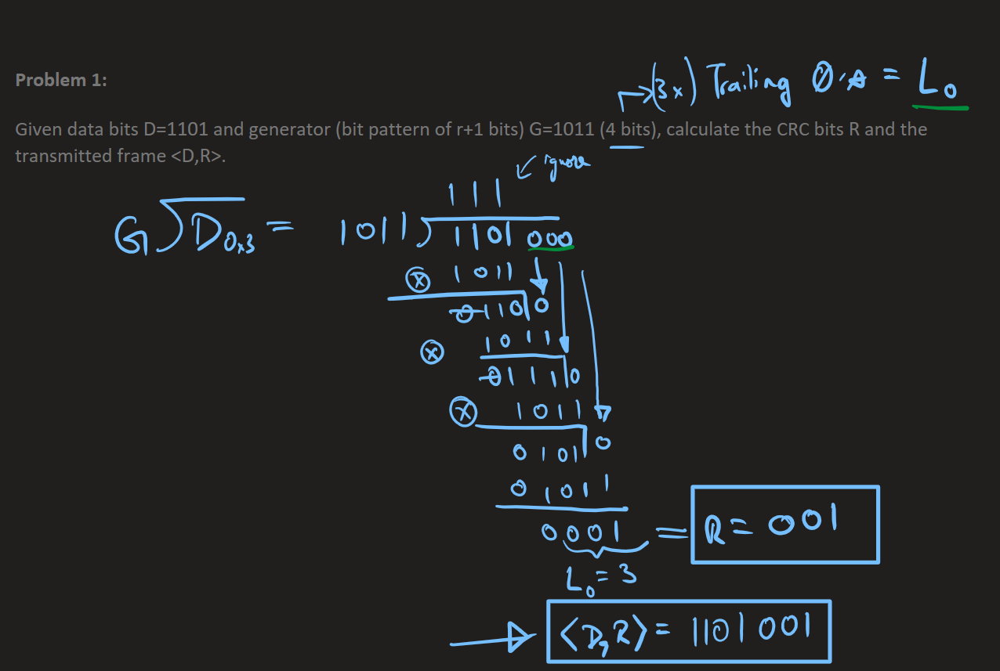
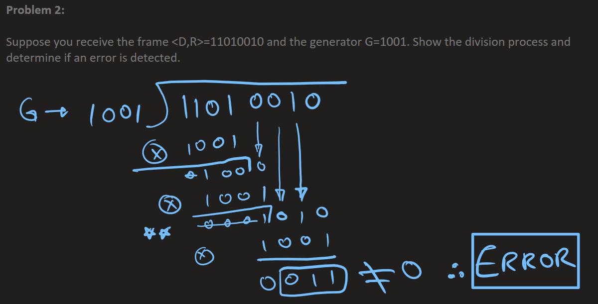
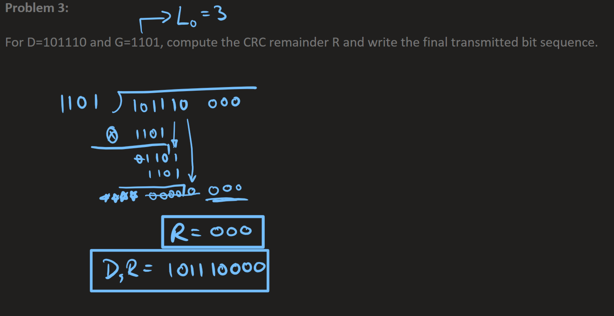

# E7710 Final Study Guide 
 - this covers chp's 4-6, wireless & security.

# OSI vs TCP/IP Layers and Example Applications

| OSI Layer      | TCP/IP Layer      | Example Applications           |
|:--------------:|:-----------------:|:------------------------------|
| 7. Application | Application       | HTTP, FTP, SMTP, DNS          |
| 6. Presentation| --------^-------- | SSL, TLS, JPEG, MPEG          |
| 5. Session     | --------^-------- | NetBIOS, RPC                  |
| 4. Transport   | Transport         | TCP, UDP                      |
| 3. Network     | Internet          | IP, ICMP, ARP                 |
| 2. Data Link   | Network Access    | Ethernet, Wi-Fi, PPP          |
| 1. Physical    | --------^-------- | Cables, Hubs, Repeaters       |

# Table of Contents

| Section | Start Line | End Line | Testable/Q&A | Link |
|---|---|---|---|---|
| [E7710 Final Study Guide](#e7710-final-study-guide) | 1 | 2 |  | [link](#e7710-final-study-guide) |
| [OSI vs TCP/IP Layers and Example Applications](#osi-vs-tcpip-layers-and-example-applications) | 4 | 15 |  | [link](#osi-vs-tcpip-layers-and-example-applications) |
| [Table of Contents](#table-of-contents) | 17 | 17 |  | [link](#table-of-contents) |
| [Chp4](#chp4) | 51 | ~588 | Yes (multiple Q&A) | [link](#chp4) |
| [Chp5](#chp5) | 590 | 977 | Yes (multiple Q&A) | [link](#chp5) |
| [Chp6](#chp6) | 979 | 1303 | Yes (multiple Q&A) | [link](#chp6) |
| [wireless](#wireless(Bob)) | 1305 | 1410 | Yes (Q&A) | [link](#wireless) |
| [security](#NetworkSecurity) | 1413 | 1600 | Yes (Q&A) | [link](#security) |

## Testable Sections (Q&A)
- [Chp4 Q&A: Page 4](#qa-page-4)
- [Chp4 Q&A: LPM (Longest Prefix Match)](#qa-lpm-longest-prefix-match)
- [Chp4 Q&A: Switching Fabrics](#qa-switching-fabrics)
- [Chp4 Q&A: Page 29 (Three-Stage Switch)](#qa-page-29-three-stage-switch)
- [Chp4 Q&A: Protocol Collision Detection](#qa-protocol-collision-detection)
- [Chp4 Q&A: Slide 32 (Output Port Queuing)](#qa-slide-32-output-port-queuing)
- [Chp4 Q&A: Slide 39 (Weighted Fair Queuing)](#qa-slide-39-weighted-fair-queuing)
- [Chp4 Q&A: IP Addressing (Slide 46 and Concepts)](#qa-ip-addressing-slide-46-and-concepts)
- [Chp4 Q&A: Subnetting, Classful vs. CIDR, DHCP, ISP Allocation](#qa-subnetting-classful-vs-cidr-dhcp-isp-allocation)
- [Chp4 NAT Q&A (Pages 66–70)](#nat-qa-pages-66-70)
- [Chp5 Q&A: Dijkstra’s Algorithm Example](#dijkstras-algorithm-example-qa-and-corrections)
- [Chp5 Q&A: Bellman-Ford Algorithm Example](#bellman-ford-algorithm-example-qa-and-corrections)
- [Comparison of Link-State (LS) and Distance Vector (DV) Algorithms](#comparison-of-link-state-ls-and-distance-vector-dv-algorithms)
- [Chp5 Q&A: Inter-AS Routing](#inter-as-routing-qa-and-notes)
- [Chp5 Q&A: BGP and Hot Potato Routing](#bgp-and-hot-potato-routing-qa-and-corrections)
- [CRC Practice Problem 1 Solution](#crc-practice-problem-1-solution)
- [CRC Practice Problem 2 Solution](#crc-practice-problem-2-solution)
- [CRC Practice Problem 3 Solution](#crc-practice-problem-3-solution)
- [CRC Comprehension Explanation](#crc-comprehension-explanation)
- [Q&A: ALOHA and CSMA/CD](#qa-aloha-and-csmacd)
- [wireless Q&A](#wireless-qa) ... does not exist
- [Q&A and Answers (Pages 131, 135)](#qa-and-answers-pages-131-135)

# Chp4
## Pages 1–10 Summary

- **Network Layer Focus:**  
  - Principles behind network layer services, especially the data plane.
  - Key topics: IP protocol, NAT, middleboxes, service models, forwarding vs. routing, router operations, addressing, generalized forwarding, and Internet architecture.

- **Data Plane Roadmap:**  
  - Overview of the network layer, including both data and control planes.
  - Router internals: input/output ports, switching, buffer management, and scheduling.
  - IP protocol details: datagram format, addressing, NAT, IPv6.
  - Generalized forwarding and SDN (Software Defined Networking), including OpenFlow.
  - Introduction to middleboxes.

- **Network-Layer Services and Protocols:**  
  - The network layer is responsible for moving transport segments from the sender to the receiver.
  - Sender encapsulates segments into datagrams and passes them to the link layer.
  - Receiver delivers segments to the transport layer protocol.

---

### Q&A: Page 4

**Q:** Which type of topology is this?
- Physical
- Logical

**A:** Logical (Because each are connected at the network layer, and the network is doing all of the work)

---

## Pages 11–20 Summary

- **Network-Layer Service Models:**  
  - Different architectures provide varying levels of Quality of Service (QoS) guarantees.
  - Service models compared:  
    - Best effort (Internet): No guarantees for bandwidth, loss, order, or timing.
    - ATM (Asynchronous Transfer Mode): Constant Bit Rate and Available Bit Rate options, with varying guarantees.
    - Internet Intserv (Integrated Services, RFC 1633): Can guarantee bandwidth, loss, order, and timing.
    - Internet Diffserv (Differentiated Services, RFC 2475): Possible guarantees, but not always provided.

- **Best-Effort Service Reflection:**  
  - Simplicity of the best-effort model enabled the Internet’s widespread adoption.
  - Sufficient bandwidth provisioning can allow real-time applications to perform well, even without strict guarantees.

---

### Q&A: LPM (Longest Prefix Match)

**Q:** In the context of IP routing, what does LPM (Longest Prefix Match) mean, and why is it important for forwarding packets in the Internet?

**Your Answer:**
Longest prefix matching classifies IP addresses by looking at every IP in one clock cycle (via complex hardware), and selecting the ip that matches the destination, matching the longest number of bits from the MSB towards the LSB, ergo "prefix". This is the fastest way to ensure "best-effort" delivery pf packages.

**Correction:**
Longest Prefix Match (LPM) is a method used by routers to select the most specific route for forwarding an IP packet. The router compares the destination IP address to all entries in its routing table and chooses the route whose network prefix matches the most leading bits (from the most significant bit downward) of the destination address. This ensures packets are forwarded along the most precise path available, which is essential for efficient and accurate routing in the Internet. LPM is not about checking every IP in one clock cycle, but about finding the routing table entry with the longest matching prefix.

---

## Pages 21–30 Summary

- **Longest Prefix Matching (LPM):**
  - Routers use the longest address prefix that matches the destination address in the routing table.
  - LPM is often implemented using TCAMs for fast lookups.
  - Cisco Catalyst switches can support around 1 million routing table entries in TCAM.
- **Switching Fabrics:**
  - Introduction to switching fabrics, the internal mechanisms routers use to move packets from input to output ports.

---

### Q&A: Switching Fabrics

**Q1:** What are the three main types of switching fabrics used in routers? Briefly describe the purpose of each.

**Your Answer:**
The 3 main types of switching fabrics used in routers are memory-type, bus-type, and interconnection-network type. Memory was invented as the original way of routing, but was slow. Bus was a big improvement in speed, but could only send one packet at a time through the bus. I.N. is the fastest, and can send multiple packets through its fabric at the same time.

**Correction:**
- Memory (Shared Memory): Oldest method, packets are written to and read from shared memory. Slow due to memory bandwidth limits.
- Bus (Shared Bus): Packets travel over a shared bus. Faster than memory, but only one packet can traverse the bus at a time, limiting throughput.
- Interconnection Network (Crossbar/Switching Fabric): Multiple packets can be transferred simultaneously via parallel paths. Most scalable and fastest.

---

**Q2:** Compare the three types of switching fabrics in terms of efficiency, scalability, and potential for call blocking. What are the main strengths and weaknesses of each?

**Your Answer:**
I have already compared the weaknesses of the 3. and likewise, Interconnection Network has the highest speed, efficiency (power consumption), and least potential for call blocking, because there are simply more channels/fabrics through which signals can pass through. The next best is bus, and the worst at each is memory.

**Correction:**
- Interconnection Network: Highest speed, efficiency, and lowest call blocking due to parallelism.
- Bus: Moderate speed, can be a bottleneck since only one packet at a time.
- Memory: Slowest, most susceptible to bottlenecks and call blocking.

---

### Q&A: Page 29 (Three-Stage Switch)

**Q1:** What is the formula for calculating the total number of crosspoints in a three-stage switch, and what do each of the variables represent?

**Your Answer:**
- of cross-points in crossbar-multistage switch = 2kN + k(N/n)^2

**Correction:**
Correct. The formula is $2kN + k(N/n)^2$, where:
- $k$ = number of crossbars in the middle stage
- $N$ = total number of inputs/outputs
- $n$ = number of inputs per crossbar

---

**Q2:** How many crossbars and what sizes are used in each stage of the three-stage, 200 × 200 switch described?

**Your Answer:**
3 stages:
 a. In the 1st stage, we have N/n = 200/20 = 10 crossbars, of size n*k = 20*4 = 80 
 b. In the 2nd stage, k = 4 crossbars, each size N/n * N/n = 10*10 = 100 
 c. 3rd stage: same as 1st (10 crossbars, size 80 each

**Correction:**
Correct breakdown:
- 1st stage: $N/n = 10$ crossbars, each $20 \times 4$
- 2nd stage: $k = 4$ crossbars, each $10 \times 10$
- 3rd stage: $10$ crossbars, each $4 \times 20$

---

**Q3:** What percentage of crosspoints does the three-stage switch use compared to a single-stage switch of the same size?

**Your Answer:**
A 1-stage 200x200 switch would use 200*200 = 40,000 , and the 3-stage uses 10*80 + 4*100 + 10*80 = 2,000 
 3 stage uses 2e3/40e3 = 0.05, or 5% of the crosspoints a 1-stage would use

**Correction:**
Correct. Three-stage switch uses $2,000$ crosspoints, which is $5\%$ of the $40,000$ crosspoints in a single-stage switch.

---

**Q4:** Why is it advantageous to use a multi-stage switch instead of a single-stage switch in terms of crosspoint efficiency?

**Your Answer:**
Since the 3-stage uses fewer crosspoints of the interconnection network fabric, it is more efficient than 1-stage, meaning higher speed. However, since fewer crosspoint are used, there is more likelihood of call blocking, I believe.

**Correction:**
Correct. Multi-stage switches are more efficient (fewer crosspoints, lower cost, higher speed), but can be more susceptible to call blocking compared to single-stage switches.

---

## Pages 31–40 Summary

 - **Input Port Queuing:**
  - If the switch fabric is slower than the combined input ports, queuing occurs at input queues.
  - Queueing delay and packet loss can result from input buffer overflow.
  - Head-of-the-Line (HOL) blocking: a datagram at the front of the queue can prevent others behind it from moving forward, causing inefficiency.

- **Output Port Queuing:**

  - Buffering is needed when datagrams arrive from the switch fabric faster than the link transmission rate.
  - Drop policy: determines which datagrams to drop if buffers are full.
  - Scheduling discipline: decides which queued datagrams are transmitted next.
  - Datagrams can be lost due to congestion or lack of buffers.
  - Priority scheduling affects performance and can raise network neutrality concerns.

- **Buffering and Congestion:**

  - Buffering is required when the arrival rate via the switch exceeds the output line speed.
  - Queueing delay and loss can occur due to output port buffer overflow.
  - RFC 3439 suggests average buffering should equal the typical round-trip time (RTT) times the link capacity.

---

### Q&A: Protocol Collision Detection

**Q:** In a network protocol, how can a collision be detected, and what actions does the router take when a collision occurs?

**Your Answer:**
A collision can be detected in the network, by checking for overvoltage at the router's input sockets. If packets collide at GHz, they will double the amplitude of each other's signals.

**Correction:**
Correct concept. Collisions are detected by monitoring voltage levels (overvoltage) on the network medium. In Ethernet, a collision causes a sudden change in voltage, which is detected by the network interface. Upon detection, a jamming signal is sent to all devices, instructing them to back off and retry after a random delay.

---

### Q&A: Slide 32 (Output Port Queuing)

**Q1:** Why is buffering required at the output port of a switch, and what happens if datagrams arrive faster than the link transmission rate?

**Your Answer:**
Buffering is required at the router o/p port if the switching fabric Tx speed is faster than the speed/capacity of the link. If arrival to output port is at a faster rate than the link, there is buffering and potential datagram drop.

**Correction:**
Correct. Buffering is required when datagrams arrive at the output port faster than the link can transmit. If the buffer fills up, datagrams may be dropped.

**Q2:** What is a drop policy in output port queuing, and why is it important for network performance?

**Your Answer:**
Drop policy is a disciplined way of dropping datagrams due to lack of buffers (buffers are at capacity). This allows the traffic of datagrams to keep flowing at the output of a very busy router.

**Correction:**
Correct. Drop policy determines which datagrams are discarded when buffers are full, helping manage congestion and maintain network performance.

---

### Q&A: Slide 39 (Weighted Fair Queuing)

**Q1:** Explain how generalized Round Robin scheduling works in the context of weighted fair queuing (WFQ).

**Your Answer:**
RR is 1 packet per class per cycle, repeating every cycle of all inputs. In WFQ, a weight is placed on each class, allowing more/less of that class to be transmitted per cycle.

**Correction:**
Correct. Generalized Round Robin (RR) sends one packet per class per cycle. In WFQ, each class is assigned a weight, so classes with higher weights send more packets per cycle.

**Q2:** How does weighted fair queuing (WFQ) provide a minimum bandwidth guarantee for each traffic class, and why is this important?

**Your Answer:**
By assigning a weight to each class the router is essentially assigning the per-class traffic-rate.

**Correction:**
Correct. By assigning weights, WFQ guarantees a minimum bandwidth for each traffic class, ensuring fair resource allocation.

---

## Pages 41–50 Summary

- **Network Neutrality (FCC 2015 Order):**
  - Three main rules:
    1. No blocking: ISPs cannot block lawful content, applications, or services.
    2. No throttling: ISPs cannot impair or degrade lawful Internet traffic based on content, application, or service.
    3. No paid prioritization: ISPs cannot engage in paid prioritization of traffic.

- **ISP Classification:**
  - Regulatory distinction between “telecommunications service” and “information service.”
  - Title II (Telecommunications): Imposes common carrier duties (reasonable rates, non-discrimination, regulation).
  - Title I (Information): No common carrier duties, less regulation, but FCC retains some authority.

- **Network Layer Roadmap (Review):**
  - Data plane and control plane overview.
  - Router internals: input/output ports, switching, buffer management, scheduling.
  - IP protocol: datagram format, addressing, NAT, IPv6.
  - Generalized forwarding, SDN, OpenFlow, middleboxes.

- **Internet Network Layer Functions:**
  - Hosts and routers perform network layer functions.
  - Path selection via routing protocols (OSPF, BGP) or SDN controller.
  - IP protocol: forwarding table, datagram format, addressing, packet handling.
  - ICMP protocol: error reporting and router signaling.

---

### Q&A: IP Addressing (Slide 46 and Concepts)

**1. Local vs. Wide Network Addressing**

**Q:** In the context of IP addressing, how many unique IP addresses are available for devices on a local network versus the entire wide network?

**Your Answer:**
For IP addressing, in a classed system, there are a certain amount of devices vs allowable networks inversely proportionally to each other by the power of 2. eg. If there are 2^7 available devices, and 2^3 networks, you can change the class to make it 2^8 available devices on 2^2 networks.

**Correction:**
Correct concept. In both classful and classless addressing, the number of available device (host) addresses and networks is determined by how many bits are allocated to each. More bits for hosts means fewer for networks, and vice versa. The total number of addresses is always $2^{\text{number of host bits}}$ per network, minus reserved addresses.

---

**2. Classless Addressing**

**Q1:** In classless addressing, what is the role of the router’s IP address within a network?

**Your Answer:**
The router's address sets the prefix for all devices in its local network. As for the last 2 nibbles of addressing on the router, I do not know what they stand for, and why they are so random in the network in page 46. however, I believe the router is to be given the LSB-nibbles "0".

**Correction:**
The router’s address typically serves as the gateway for the local network and shares the same network prefix as the devices it serves. The last bits (host portion) can be any valid host address, but often the first or last usable address is chosen.

**Q2:** What is a broadcast address in classless addressing, and how is it determined?

**Your Answer:**
I am currently unsure, but I feel we can iron this out when we study the next 2 decades of slides (subnets and CIDR)

**Correction:**
The broadcast address in classless addressing is the highest address in the subnet (all host bits set to 1). We’ll clarify this further with subnets/CIDR.

**Q3:** How do you calculate the number of usable device/host addresses in a classless network?

**Your Answer:**
Count the number of available addresses (eg. 2^7 = 128), and subtract 2 (0 for router, 127 for broadcast), and you have the available, USABLE addresses 1-126 (total = 126).

**Correction:**
Correct! Usable host addresses = $2^{\text{host bits}} - 2$ (subtracting network and broadcast addresses).

**Q4:** How do you determine the total number of IP addresses in a classless network?

**Your Answer:**
Once again, I am unsure at this point

**Correction:**
The total number of addresses in a classless network is $2^{\text{host bits}}$.

---

**3. Classful Addressing**

**Q1:** What are the ranges and examples of class A, class B, and class C IP addresses?

**Your Answer:**
I will avoid talking about subnets for now. Class A uses addresses 0-127, class B is 128-192, class C is 193+

**Correction:**
Class A: 0.0.0.0 – 127.255.255.255 (e.g., 10.0.0.1), Class B: 128.0.0.0 – 191.255.255.255 (e.g., 172.16.0.1), Class C: 192.0.0.0 – 223.255.255.255 (e.g., 192.168.1.1).

**Q2:** What is the main difference between classless and classful IP addressing?

**Your Answer:**
Classful we have described: the last 2 nibbles determine the class. For classless, the last 2 nibbles can be anything, followed by a /##, which indicates to which network the address belongs. Classless is useful when the network itself assigns its own routing algorithms

**Correction:**
Classful addressing uses fixed boundaries for network/host bits (based on address class), while classless addressing (CIDR) allows variable-length prefixes (e.g., /24), making address allocation more flexible and efficient.

---

## Pages 51–60 Summary

- **Subnets:**
  - Subnets divide a network into smaller, manageable segments.
  - Example subnets: 223.1.1/24, 223.1.2/24, 223.1.3/24, etc.
  - Subnet addresses use a prefix (e.g., /24) to indicate the network portion.

- **CIDR (Classless InterDomain Routing):**
  - Allows subnet portion of address to be of arbitrary length.
  - Address format: a.b.c.d/x, where x is the number of bits in the subnet portion.
  - Example: 200.23.16.0/23.

- **Obtaining IP Addresses:**
  - Two questions:
    1. How does a host get its IP address within a network? (host part)
    2. How does a network get its IP address? (network part)
  - Host IP assignment:
    - Hard-coded by sysadmin.
    - DHCP (Dynamic Host Configuration Protocol): dynamically assigns IP addresses, enabling plug-and-play networking.

- **DHCP:**
  - Goal: Host dynamically obtains IP address from a network server when joining the network.

---

### Key Concepts from Conversation

- The /24 means the first 24 bits of the IP address are the network (subnet) prefix. In dotted-decimal notation (e.g., 192.168.1.0), each octet is 8 bits, so /24 covers the first three octets: 192.168.1.
- A nibble is 4 bits, but IP addresses are grouped in octets (8 bits), not nibbles. So /24 = 3 octets = 24 bits.
- IPv4 addresses are written in dotted-decimal, not hexadecimal. Each octet is a decimal value from 0 to 255.
- For class C, the first octet ranges from 192 to 223. The next three octets can be any value from 0 to 255.
- Example class C addresses: 192.168.1.1, 200.10.20.30, 223.255.255.254.

---

### Q&A: Subnetting, Classful vs. CIDR, DHCP, ISP Allocation

**1. Subnet Calculation Example**

**Q:** Given the address 192.168.1.25/25:
- How many host bits are available?
- How many total addresses are in this subnet?
- How many usable device addresses are there?
- What are the roles of the .0 and .127 addresses?
- How would this change if the subnet were /24 instead?

**Your Answer:**
- 8*4 - 25 = 7 … 2^7 = 128 bits available for host addresses
- 128 total addresses available in this subnet
- 128 - 2 (router, broadcast) = 126 usable addresses
- .0 is the router address , and .127 is the broadcast address for this subnet
- 8*4 - 24 = 8 … 2^8 = 256 available addresses, and 254 usable addresses for devices, and 255 would be for broadcast.

**Correction:**
- 32 - 25 = 7 host bits → $2^7 = 128$ addresses.
- 128 total addresses, 126 usable (subtract network and broadcast).
- .0 is the network address (not specifically router), .127 is the broadcast address.
- For /24: 8 host bits → $2^8 = 256$ addresses, 254 usable, .0 is network, .255 is broadcast.

---

**2. Classful vs. CIDR Comparison**

**Q:** Compare the following addresses as classful and CIDR:
- Class A: 10.0.0.1 (classful) vs. 10.0.0.1/24 (CIDR)
- Class B: 172.16.0.1 (classful) vs. 172.16.0.1/20 (CIDR)
- Class C: 192.168.1.1 (classful) vs. 192.168.1.1/28 (CIDR)
How would the router’s handling of these addresses differ between classful and CIDR addressing?

**Your Answer:**
- 10.0.0.1 indicates class A, and the /24, if CIDR, means that 24 bits are used for subnet. In Class A, there is a limit of 256 available addresses, but CIDR can change this. 
- Crossing 128.x.x.x, we enter into class B "172.16.0.1". The class/classless comparison is the same as for class A's example.
- Crossing 192.x.x.x, we enter into class C "192.168.1.1". The class/classless comparison is the same as for class A's example. 
- I am not sure how the router’s handling of these addresses would differ between classful and CIDR addressing

**Correction:**
- Classful: Address class determines fixed network/host split (A: /8, B: /16, C: /24).
- CIDR: Prefix length (e.g., /24) can be applied to any address, allowing flexible subnetting.
- Routers use the prefix length in CIDR to determine the network portion, not the class. CIDR enables more efficient routing and address allocation.

---

**3. Slide 53: IP Address Assignment**

**Q1:** How does a host get its IP address within its network?
**Q2:** How does a network get its IP address for itself?
**Q3:** What are two common ways a host can obtain its IP address?

**Your Answer:**
- Either the host device is given a static IP, or it is given a dynamic address by the router via DHCP, based on the subnet prefix of the router, and the order in which it had been connected to the LAN.
- A network gets it's own IP address from the smart network, which assigns IP addresses to each router.
- Static/manual setup at host and router's end, or DHCP ar 2 ways a host can obtain an IP

**Correction:**
- Hosts get IPs via static/manual assignment or dynamically via DHCP.
- Networks get their address blocks from ISPs or higher-level authorities.
- Two common ways for host IP assignment: static/manual or DHCP.

---

**4. DHCP Ports**

**Q:** What are the roles of ports 8, 67, and 68 in DHCP operation?

**Your Answer:**
- 8???
- 67 - source
- 68 - destination

**Correction:**
- Port 8 is not used in DHCP.
- Port 67: DHCP server listens here (source for server).
- Port 68: DHCP client listens here (destination for client).

---

**5. Page 60: ISP Address Allocation**

**Q:** How does an ISP allocate address space to organizations, and how does CIDR allow for flexible block assignment? Use the example of 200.23.16.0/20 and its division into /23 blocks.

**Your Answer:**
- The ISP itself has its own address space, indicared by the prefix (subnet mask) /20. it then assigns sub-networks of /23, meaning (23 - 20 = 3 … 2^3 = 8) … 8 different blocks can be set apart for different organizations in that ISP's address space. However, this seems way too small, and I do not think any ISP would only be able to provide this few networks to so few organizations. It does not seem economically sustainable.

**Correction:**
- ISP with 200.23.16.0/20 can divide into 8 blocks of /23 (each with 512 addresses).
- CIDR allows flexible block sizes, not limited by class boundaries.
- Real ISPs use much larger blocks, but the example illustrates the principle.

---

## Pages 61-70 Summary

- **Hierarchical Addressing & Route Aggregation:**
  - Hierarchical addressing enables efficient advertisement and aggregation of routing information.
  - Example: An ISP can advertise a single route for a block of addresses (e.g., 200.23.16.0/20) that covers multiple organizations, each with their own subnet (e.g., 200.23.16.0/23, 200.23.18.0/23, etc.).
  - This reduces the number of routes that need to be advertised and managed in the global routing tables.

- **More Specific Routes:**
  - If an organization changes ISPs, the new ISP advertises a more specific route for that organization’s subnet.
  - Example: Organization 1 moves from Fly-By-Night-ISP to ISPs-R-Us, which then advertises a specific route for 200.23.18.0/23.
  - This allows for flexible and dynamic routing updates without disrupting the overall aggregation.

---

## Pages 71-80 Summary
- **IPv6 Motivation:**
  - IPv4’s 32-bit address space is limited and would eventually be exhausted.
  - IPv6 uses a 128-bit address space, vastly increasing available addresses.
  - IPv6 header is 40 bytes, fixed length, designed for faster processing and forwarding.
  - Supports differentiated treatment of “flows” (though the concept is not strictly defined).
- **IPv6 Datagram Format:**
  - 128-bit source and destination addresses.
  - Priority and flow label fields for identifying and managing flows.
  - No checksum (for speed), no fragmentation/reassembly, no options (handled by upper-layer protocols).
- **Transition from IPv4 to IPv6:**
  - Not all routers can be upgraded at once; no “flag day.”
  - Mixed IPv4/IPv6 networks operate using tunneling: IPv6 datagrams are encapsulated within IPv4 datagrams for transport across IPv4 routers.
  - Tunneling is also used in other contexts (e.g., 4G/5G).
- **Tunneling and Encapsulation:**
  - Example: Ethernet connects two IPv6 routers, and IPv6 packets are tunneled through IPv4 infrastructure.

  ---

## other pages - Summary
- **Page 81**
  - Flow tables define match+action rules for packets.
  - Match header fields; actions: drop, forward, modify, or send to controller.
  - Priority resolves overlaps; counters track usage.
- **Page 82**
  - Flow table uses wildcards for flexible matching.
  - Example actions: forward, drop, send to controller.
- **Page 89**
  - Generalized forwarding: match bits in any header, take programmable actions.
  - Enables network programmability (e.g., P4 language).

---

## Summary: NAT (Network Address Translation) [Pages 66-70]

- **NAT Overview:**
  - NAT allows all devices in a local network to share a single public IPv4 address as seen by the outside world.
  - Devices use private IP address ranges (10/8, 172.16/12, 192.168/16) within the local network, which are not routable on the public Internet.
  - Outgoing datagrams from local devices have their source IP and port replaced by the NAT router with its public IP and a new port number. The NAT router keeps a translation table to map these changes.
  - Incoming datagrams are translated back to the correct internal IP and port using this table.

- **Advantages of NAT:**
  - Only one public IP address is needed from the ISP for all local devices.
  - Internal addresses can be changed without affecting the outside world.
  - Changing ISPs does not require readdressing internal devices.
  - Provides a security benefit: devices inside the local network are not directly accessible from the outside.

- **NAT Implementation:**
  - The NAT router transparently rewrites source/destination IP addresses and ports for outgoing/incoming packets.
  - Maintains a NAT translation table to track active connections.

- **Controversies and Limitations:**
  - NAT breaks the end-to-end principle of the Internet by modifying transport-layer information.
  - Makes it difficult for external clients to initiate connections to devices behind NAT (NAT traversal is required for some applications).
  - Some argue that IPv6 should solve address exhaustion instead of relying on NAT.
  - Despite controversy, NAT is widely used in homes, institutions, and cellular networks.

---

## NAT Q&A (Pages 66–70)

**Q1:** What are the main advantages of using NAT in a local network?
**A1:** Just 1 ISP address per network of devices, can change a host address with no effect on the outside world, can change ISP with no local disturbances, and it's more secure.
**Feedback:** Correct! You listed all key advantages: only one ISP address needed, internal address changes don’t affect the outside, changing ISPs is easy, and increased security.

**Q2:** How does a NAT router handle outgoing and incoming datagrams in terms of IP address and port translation?
**A2:** When entering the WAN, NAT changes the local (source) IP into NAT, and when re-entering LAN, it converts from NAT back to local IP addresses.
**Feedback:** Correct! The NAT router translates local IP/port to its public IP/port for outgoing traffic, and reverses the translation for incoming traffic.

**Q3:** What are two major controversies or limitations associated with NAT, and why do some argue that IPv6 should replace it?
**A3:** NAT defies the end-to-end argument, by trying to control too much of the network and link layers, and it will eventually lead to an address shortage (which could be fixed by using IPv6).
**Feedback:** Correct! NAT breaks the end-to-end principle and complicates network-layer operations. The address shortage issue is a major reason for IPv6 adoption.

---

# Chp5
## Chapter 5: Network Layer Control Plane (Pages 1–10)

### Summary
- **Network Layer Control Plane**: Principles behind network control, including traditional routing algorithms, SDN controllers, and network management/configuration.
- **Key Protocols & Technologies**:
	- OSPF (Open Shortest Path First)
	- BGP (Border Gateway Protocol)
	- OpenFlow, ODL (OpenDaylight), ONOS (Open Network Operating System) controllers
	- ICMP (Internet Control Message Protocol)
	- SNMP (Simple Network Management Protocol), YANG/NETCONF
- **Roadmap**:
	- Routing protocols: link state, distance vector
	- Intra-ISP routing (OSPF), inter-ISP routing (BGP)
	- SDN control plane
	- Network management and configuration
- **Network-Layer Functions**:
	- Forwarding: Moving packets from router input to output (data plane)
	- Routing: Determining packet routes from source to destination (control plane)
- **Control Plane Approaches**:
	- Per-router control (traditional)
	- Logically centralized control (SDN)

## Chapter 5: Network Layer Control Plane (Pages 11–20)

### Summary
- **Control Plane Roadmap (continued)**:
  - Routing protocols: link state, distance vector
  - Intra-ISP routing (OSPF), inter-ISP routing (BGP)
  - SDN control plane, ICMP, network management (SNMP, NETCONF/YANG)

- **Dijkstra’s Link-State Routing Algorithm**:
  - Centralized approach: all nodes know network topology and link costs via link state broadcast.
  - Computes least-cost paths from a source node to all other nodes, building the forwarding table.
  - Iterative process: after k iterations, least-cost path to k destinations is known.
  - Notation:
    - $c_{x,y}$: direct link cost from node x to y ($\infty$ if not direct neighbors)
    - $D(v)$: current estimate of cost of the least-cost-path from source to destination v
    - $p(v)$: predecessor node along path from source to v
    - $N'$: set of nodes whose least-cost-path is definitively known

- **Algorithm Steps**:
  1. Initialization: set of known nodes $N' = \{u\}$ (source node)
  2. For all nodes v:
     - If v is adjacent to u, $D(v) = c_{u,v}$
     - Else, $D(v) = \infty$
  3. Loop:
     - Find w not in $N'$ with minimum $D(w)$
     - Add w to $N'$
     - Update $D(v)$ for all v adjacent to w and not in $N'$:
       $D(v) = \min(D(v), D(w) + c_{w,v})$
     - Repeat until all nodes are in $N'$

- **Example**: Step-by-step illustration of Dijkstra’s algorithm (details continue in subsequent pages).

## Dijkstra’s Algorithm Example: Finding All Paths from Node-0

### Example Table: Results of Dijkstra’s Algorithm

| Iteration | T           | L(2) | Path | L(3) | Path | L(4) | Path | L(5) | Path | L(6) | Path |
|-----------|-------------|------|------|------|------|------|------|------|------|------|------|
| 1         | {1}         | 2    | 1-2  | 5    | 1-3  | 1    | 1-4  | ∞    | -    | ∞    | -    |
| 2         | {1,4}       | 2    | 1-2  | 4    | 1-4-3| 1    | 1-4  | 2    | 1-4-5| ∞    | -    |
| 3         | {1,2,4}     | 2    | 1-2  | 4    | 1-4-3| 1    | 1-4  | 2    | 1-4-5| ∞    | -    |
| 4         | {1,2,4,5}   | 2    | 1-2  | 3    | 1-4-5-3| 1  | 1-4  | 2    | 1-4-5| 4    | 1-4-5-6|
| 5         | {1,2,3,4,5} | 2    | 1-2  | 3    | 1-4-5-3| 1  | 1-4  | 2    | 1-4-5| 4    | 1-4-5-6|
| 6         | {1,2,3,4,5,6}| 2   | 1-2  | 3    | 1-4-5-3| 1  | 1-4  | 2    | 1-4-5| 4    | 1-4-5-6|

- **T**: Set of nodes whose least-cost path is known so far.
- **L(x)**: Least cost to node x from the source (node-1 in this table, but node-0 in the diagram).
- **Path**: The actual path taken from the source to node x.

### Dijkstra’s Algorithm Example: Walkthrough & Q&A

#### Walkthrough
- **Iteration**: Each row shows the state of the algorithm after a step.
- **T**: The set of nodes whose shortest path from the source is finalized.
- **L(x)**: The current least cost to reach node x from the source.
- **Path**: The actual path taken from the source to node x.

1. **Initialization (Iteration 1):**
   - Only the source node (node-1) is in T.
   - Direct costs to neighbors are set; others are ∞ (unreachable).
   - Paths are direct if possible.
2. **Iteration 2:**
   - The next closest node (node-4) is added to T.
   - Costs and paths are updated for all nodes adjacent to node-4.
3. **Subsequent Iterations:**
   - Each time, the node with the smallest tentative cost is added to T.
   - Costs and paths to all other nodes are updated if a shorter path is found via the newly added node.
4. **Final Iteration:**
   - All nodes are included in T.
   - The table shows the least cost and path from the source to every node.

---

### Dijkstra’s Algorithm Example: Q&A and Corrections

**Question 1:** In the first iteration, why are the costs to some nodes set to ∞?
- **Your Answer:** In the 1st iteration, costs are ∞, because those nodes are unreachable directly (not directly connected to node 1)
- **Correction:** Correct! In Dijkstra’s algorithm, nodes not directly connected to the source are initialized with ∞ cost, indicating they are unreachable until a path is found.

**Question 2:** What does the set T represent at each step?
- **Your Answer:** T represents the nodes for which the least cost path has been calculated so far. The actual costs of each link are not in this table, we are simply looking at the results of a hypothetical simulation of Dijkstra's algorithm.
- **Correction:** Correct! T is the set of nodes whose shortest path from the source has been finalized.

**Question 3:** How does the algorithm decide which node to add to T next?
- **Your Answer:** The algorithm adds the node to T whose link is the cheapest ($-cost) to transmit through
- **Correction:** Partially correct. The algorithm adds the node with the smallest current tentative cost (D value) from the source, not just the cheapest direct link, but the lowest cost among all possible paths from the source to nodes not yet in T.

**Question 4:** In iteration 4, what is the least-cost path to node 3, and how is it determined?
- **Your Answer:** The cheapest path to node-3 is 1-4-5-3, and this has been determined through 4 iterations to every possible node
- **Correction:** Correct! The least-cost path to node 3 is found by updating paths as new nodes are added to T, always choosing the path with the lowest cumulative cost.

**Question 5:** Why do the paths and costs sometimes change in later iterations?
- **Your Answer:** Path can change due to finding better, cheaper links as more nodes are added to the {T}-set. I am not sure how costs change or if they are changing at all
- **Correction:** Correct! As new nodes are added to T, the algorithm may discover shorter paths to other nodes via these new additions, updating both the path and the cost if a better route is found.

---

## Chapter 5: Network Layer Control Plane (Pages 21–30)

### Summary
- **Distance Vector Algorithm**:
  - Based on the Bellman-Ford (BF) equation (dynamic programming).
  - Bellman-Ford equation:
    - $D_x(y) = \min_v \{ c_{x,v} + D_v(y) \}$
      - $D_x(y)$: cost of least-cost path from node x to y.
      - $c_{x,v}$: direct cost of link from x to neighbor v.
      - $D_v(y)$: neighbor v’s estimated least-cost-path cost to y.
      - The minimum is taken over all neighbors v of x.

- **Bellman-Ford Example**:
  - Each node maintains a distance vector (DV) with its estimate of the least-cost path to every destination.
  - Example calculation for node u to destination z:
    - $D_u(z) = \min \{ c_{u,v} + D_v(z), c_{u,x} + D_x(z), c_{u,w} + D_w(z) \}$
    - The next hop is the neighbor achieving the minimum cost.

- **Distance Vector Algorithm Key Ideas**:
  - Periodically, each node sends its distance vector estimate to its neighbors.
  - When a node receives a new DV estimate from a neighbor, it updates its own DV using the Bellman-Ford equation.
  - Under typical conditions, the estimates converge to the actual least cost.

## Bellman-Ford Algorithm Example: Distance Vector Table

| h | Lh(2) | Path | Lh(3) | Path | Lh(4) | Path | Lh(5) | Path | Lh(6) | Path |
|---|-------|------|-------|------|-------|------|-------|------|-------|------|
| 0 | ∞     | -    | ∞     | -    | ∞     | -    | ∞     | -    | ∞     | -    |
| 1 | 2     | 1-2  | 5     | 1-3  | 1     | 1-4  | ∞     | -    | ∞     | -    |
| 2 | 2     | 1-2  | 4     | 1-4-3| 1     | 1-4  | 2     | 1-4-5| 10    | 1-3-6|
| 3 | 2     | 1-2  | 3     | 1-4-5-3| 1   | 1-4  | 2     | 1-4-5| 4     | 1-4-5-6|
| 4 | 2     | 1-2  | 3     | 1-4-5-3| 1   | 1-4  | 2     | 1-4-5| 4     | 1-4-5-6|

- **h**: Iteration step
- **Lh(x)**: Least cost to node x from the source (node-1)
- **Path**: The actual path taken from the source to node x

### Bellman-Ford Algorithm Example: Walkthrough

- **Initialization (h = 0):**
  - All costs are set to ∞ (unreachable) except for the source node.
  - No paths are known yet.

- **Iteration 1 (h = 1):**
  - Direct neighbors of the source node (node-1) have their costs updated.
  - Paths to these nodes are direct (e.g., 1-2, 1-3, 1-4).

- **Iteration 2 (h = 2):**
  - Costs and paths are updated using information from neighbors’ distance vectors.
  - New paths may be discovered (e.g., 1-4-3, 1-4-5, 1-3-6).

- **Iteration 3 & 4 (h = 3, 4):**
  - The algorithm continues to update costs and paths as more information is exchanged.
  - The least-cost paths to all nodes are finalized as the algorithm converges.

- **Key Points:**
  - Each node updates its distance vector based on its neighbors’ information.
  - The process repeats until all nodes have the least-cost path from the source.

---

### Bellman-Ford Algorithm Example: Q&A and Corrections

**Question 1:** Why are all costs set to ∞ in the initial step?
- **Your Answer:** Initially, all cost are ∞ because you only focus on the starting node, with no cost.
- **Correction:** Correct! At initialization, only the source node has a cost of 0; all other nodes are set to ∞ because their paths are unknown.

**Question 2:** How does the algorithm update the cost to a node in each iteration?
- **Your Answer:** In every subsequent iteration, the cost to each neighbour is updated within each router/node.
- **Correction:** Correct! Each node updates its cost to every destination by considering the costs reported by its neighbors and applying the Bellman-Ford equation.

**Question 3:** What triggers a change in the path to a node during the algorithm?
- **Your Answer:** When a neighbour sees a cheaper path, it gossips to its neighbours about it, and everyone goes that path.
- **Correction:** Correct! If a neighbor advertises a lower-cost path to a destination, other nodes update their own paths to use this new, cheaper route.

**Question 4:** In iteration 2, what is the least-cost path to node 5, and how is it determined?
- **Your Answer:** The cheapest path to node-5 in h(2) is 1-4-5, which later iterations show is actually the cheapest path.
- **Correction:** Correct! The path 1-4-5 is found by comparing all possible routes and selecting the one with the lowest cumulative cost.

**Question 5:** Why do the costs and paths stabilize after a few iterations?
- **Your Answer:** Paths stabilize after a few iterations, because every node in the network has access to all the gossip (each path pretty-much knows the cost of each link, everywhere).
- **Correction:** Correct! After enough exchanges, all nodes have the most up-to-date information, and the network converges to the actual least-cost paths.

---

## Comparison of Link-State (LS) and Distance Vector (DV) Algorithms

| Aspect                | Link-State (LS)                                      | Distance Vector (DV)                                 |
|-----------------------|------------------------------------------------------|------------------------------------------------------|
| **Message Complexity**| n routers, O(n²) messages sent                       | Exchange between neighbors; convergence time varies   |
| **Speed of Convergence** | O(n²) algorithm, O(n²) messages; may have oscillations | Convergence time varies; may have routing loops; count-to-infinity problem |
| **Robustness**        | Router can advertise incorrect link cost; each router computes only its own table | DV router can advertise incorrect path cost (e.g., “I have a really low cost path to everywhere”): black-holing; each router’s table used by others, so errors propagate through network |

## Chapter 5: Network Layer Control Plane (Pages 31–40)

### Summary
- **Inter-AS Routing (Interdomain Routing):**
  - When a router in one Autonomous System (AS) receives a datagram destined for outside its AS, it must forward it to a gateway router.
  - Inter-domain routing must:
    1. Learn which destinations are reachable through which neighboring ASes.
    2. Propagate this reachability information to all routers within the AS.

- **Intra-AS Routing Protocols:**
  - **RIP (Routing Information Protocol):**
    - Classic distance vector protocol; DVs exchanged every 30 seconds.
    - No longer widely used.
  - **EIGRP (Enhanced Interior Gateway Routing Protocol):**
    - DV-based; formerly Cisco-proprietary, now open.
  - **OSPF (Open Shortest Path First):**
    - Link-state protocol; each router floods link-state advertisements to all others in the AS.
    - Multiple link cost metrics (bandwidth, delay).
    - Each router computes its forwarding table using Dijkstra’s algorithm.
    - Security: OSPF messages are authenticated.

- **Hierarchical OSPF:**
  - Two-level hierarchy: local area and backbone.
  - Link-state advertisements are flooded only within an area or the backbone.
  - Each node knows detailed topology of its area, but only the direction to other areas.
  - Area border routers summarize distances to destinations in their area and advertise in the backbone.

### Inter-AS Routing: Q&A and Notes

**Question 1:** Which of the following routing protocols uses link-state (Dijkstra’s) routing?
- **Your Answer:** c) OSPF
- **Correction:** Correct! OSPF uses link-state routing and Dijkstra’s algorithm to compute paths.

**Question 2:** Which of the following routing protocols is based on distance vector (open-vector) routing?
- **Your Answer:** a) RIP, b) EIGRP
- **Correction:** Correct! Both RIP and EIGRP are distance vector protocols.

**Question 3:** What is an Autonomous System (AS) in the context of Internet routing, and why is it important?
- **Your Answer:** An AS is a routing domain, which has control of all the routing algorithms within its own domain (intra) and externally (inter).
- **Correction:** Correct! An AS is a collection of IP networks and routers under the control of a single organization, which manages routing within the AS and exchanges routing information with other ASes.

**Note:** In general, as frequency increases, losses increase, and range decreases.

---

## Chapter 5: Network Layer Control Plane (Pages 41–50)

### Summary
- **BGP Path Advertisement:**
  - Gateway routers may learn about multiple paths to a destination.
  - Example: AS1 gateway router 1c learns path AS2,AS3,X from 2a and path AS3,X from 3a.
  - Path selection is based on policy; the chosen path is advertised within the AS via iBGP.

- **BGP Messages:**
  - BGP messages are exchanged between peers over a TCP connection.
  - Types of BGP messages:
    - **OPEN:** Opens TCP connection to remote BGP peer and authenticates the sender.
    - **UPDATE:** Advertises new path or withdraws old path.
    - **KEEPALIVE:** Keeps connection alive in absence of UPDATE messages; also acknowledges OPEN requests.
    - **NOTIFICATION:** Reports errors in previous messages; also used to close the connection.

- **BGP Path Advertisement Example:**
  - Illustrates how gateway routers advertise learned paths to other routers within the AS.

### BGP and Hot Potato Routing: Q&A and Corrections

**Question:** What is “hot potato routing” in the context of interdomain routing, and why might an AS use it?
- **Your Answer:** Hot potato routing is to get this packet out of our domain asap. Domains use it to try and minimize how much money they spend moving packets through their networks.
- **Correction:** Correct! Hot potato routing means an AS forwards a packet to the nearest exit point to another AS as quickly as possible, minimizing the resources and cost spent within its own network.

---

## Chapter 5: Network Layer Control Plane (Pages 51–60)

### Summary
- **Traditional Network Layer Control:**
  - Historically, the Internet’s network layer used a distributed, per-router control approach.
  - Each router was a monolithic device running proprietary implementations of standard protocols (IP, RIP, IS-IS, OSPF, BGP) in a proprietary OS (e.g., Cisco IOS).
  - Specialized “middleboxes” (firewalls, load balancers, NAT) handled additional network functions.

- **Shift Toward Software Defined Networking (SDN):**
  - Around 2005, there was renewed interest in rethinking the network control plane.
  - SDN separates the control plane from the data plane.
  - A remote controller computes and installs forwarding tables in routers, rather than each router computing its own.

- **Benefits of a Logically Centralized Control Plane (SDN):**
  - Easier network management, fewer misconfigurations, and greater flexibility in traffic flows.
  - Table-based forwarding (e.g., via OpenFlow API) allows routers to be “programmed” centrally.
  - Centralized programming is easier than distributed programming, which requires coordination among all routers.
  - Open (non-proprietary) control plane implementations foster innovation.

- **Analogy:**
  - The shift to SDN is compared to the mainframe-to-PC revolution, moving from specialized, closed systems to open, programmable platforms.

---

## Chapter 5: Network Layer Control Plane (Pages 61–70)

### Summary
- **SDN Controller (Network Operating System):**
  - Maintains network state information.
  - Interacts with network control applications “above” via a northbound API.
  - Interacts with network switches “below” via a southbound API.
  - Implemented as a distributed system for performance, scalability, fault-tolerance, and robustness.

- **Network-Control Applications:**
  - These are the “brains” of the control plane, implementing control functions (e.g., routing, access control, load balancing) using services and APIs provided by the SDN controller.
  - Applications are unbundled and can be provided by third parties, separate from the routing vendor or SDN controller.

- **SDN Architecture:**
  - The SDN controller sits between network-control applications and SDN-controlled switches.
  - The northbound API allows applications to communicate with the controller.
  - The southbound API allows the controller to manage the data plane (switches).

---

## Chapter 5: Network Layer Control Plane (Pages 71–80)

### Summary
- **SDN: Selected Challenges**
  - Hardening the control plane: making it dependable, reliable, scalable, and secure.
  - Robustness to failures: leveraging distributed system theory for reliability.
  - Dependability and security should be integrated from the start.
  - Networks and protocols must meet mission-specific requirements (e.g., real-time, ultra-reliable, ultra-secure).
  - Internet-scaling: SDN must work beyond a single AS.
  - SDN is critical in 5G cellular networks.

- **SDN and the Future of Traditional Network Protocols**
  - SDN-computed forwarding tables vs. router-computed tables: example of centralized vs. distributed computation.
  - Potential for SDN-computed congestion control: controller sets sender rates based on congestion reports from routers.
  - Open question: How will SDN and traditional protocol-based network functionality evolve?

- **Network Layer Control Plane Roadmap (Recap)**
  - Introduction, routing protocols, intra-ISP routing (OSPF), inter-ISP routing (BGP), SDN control plane, ICMP, network management/configuration (SNMP, NETCONF/YANG).

- **ICMP: Internet Control Message Protocol**
  - Used by hosts and routers to communicate network-level information (error reporting, echo request/reply for ping).
  - Operates above IP; ICMP messages are carried in IP datagrams.
  - ICMP message structure: type, code, plus first 8 bytes of the IP datagram causing the error.
  - Example types/codes: echo reply, destination unreachable (network, host, protocol, port), network unknown.

---

## Chapter 5: Network Layer Control Plane (Pages 81–90)

### Summary
- **SNMP Protocol: Message Types**
  - **GetRequest, GetNextRequest, GetBulkRequest:** Manager-to-agent requests for data (single instance, next in list, or block of data).
  - **SetRequest:** Manager-to-agent request to set a value in the Management Information Base (MIB).
  - **Response:** Agent-to-manager reply with requested value or response to a request.
  - **Trap:** Agent-to-manager notification of an exceptional event.

- **SNMP Protocol: Message Formats**
  - **Get/Set Header:** Used for message types 0–3 (GetRequest, GetNextRequest, GetBulkRequest, SetRequest).
    - Includes PDU type, request ID, error status, error index, variable name, and value.
  - **Trap Header:** Used for message type 4 (Trap).
    - Includes enterprise, agent address, trap type, specific code, value, and timestamp.

---

## Chapter 5: Network Layer Control Plane (Pages 91–100)

### Summary
- **Distance Vector: Another Example**
  - Shows step-by-step updates of distance vectors for nodes x, y, and z.
  - Initial costs are set (e.g., x to y is 2, x to z is 7).
  - Each node updates its distance vector by considering the costs from its neighbors and applying the Bellman-Ford equation:
    - $D_x(z) = \min\{c_{x,y} + D_y(z), c_{x,z} + D_z(z)\}$
    - $D_x(y) = \min\{c_{x,y} + D_y(y), c_{x,z} + D_z(y)\}$
  - The process continues until all nodes have the least-cost paths to each other.

- **Table Example:**
  - Shows how the cost and path to each node are updated over time as information is exchanged between nodes.

---

# Chp6

This file will be used to collect summaries, notes, Q&A, and answers as you progress through your exam preparation workflow.

---

## Pages 1-10 Summary

- **Link Layer & LANs Overview**
	- The link layer is responsible for transferring data between physically adjacent nodes over a link.
	- Key services: error detection/correction, sharing broadcast channels (multiple access), link layer addressing, and local area networks (Ethernet, VLANs).
	- Implementation of various link layer technologies and datacenter networks.

- **Roadmap of Topics**
	- Introduction to link layer and LANs.
	- Error detection and correction methods.
	- Multiple access protocols for channel sharing.
	- LANs: addressing, ARP, Ethernet, switches, VLANs.
	- Link virtualization (MPLS) and data center networking.
	- Example: a day in the life of a web request.

- **Terminology**
	- Nodes: hosts and routers.
	- Links: communication channels (wired, wireless, LANs).
	- Layer-2 packet: frame (encapsulates datagram).

## Pages 11-20 Summary

- **Error Detection Concepts**
	- Error detection and correction (EDC) bits add redundancy to data for protection.
	- Data (D) is protected by error checking, which may include header fields.
	- Bit errors can occur on links, and error detection is not 100% reliable, but larger EDC fields improve detection and correction.

- **Parity Checking**
	- Single bit parity: detects single bit errors.
	- Two-dimensional bit parity: can detect and correct single bit errors.
	- Even parity: parity bit is set so the total number of 1’s is even.

- **Internet Checksum**
	- Used to detect errors in transmitted segments (e.g., UDP).
	- Sender treats segment as a sequence of 16-bit integers and computes a one’s complement sum (checksum), which is sent with the data.
	- Receiver computes the checksum of the received segment and compares it to the received checksum value. If they differ, an error is detected.
	- Not perfect—some errors may go undetected.

- **Cyclic Redundancy Check (CRC)**
	- A powerful error-detection coding technique widely used in practice (Ethernet, WiFi).
	- Data bits (D) are combined with CRC bits (R) so that the resulting bit pattern is exactly divisible by a generator (G).
	- Receiver divides the received pattern by G; a non-zero remainder indicates an error.
	- Can detect all burst errors less than r+1 bits.

- **Multiple Access Links & Protocols**
	- Two types of links: point-to-point (e.g., between switch and host) and broadcast (shared wire/medium, e.g., Ethernet, WiFi, satellite).
	- Multiple access protocols are distributed algorithms that determine how nodes share a single broadcast channel and when they can transmit.
	- Simultaneous transmissions can cause interference and collisions.

- **Ideal Multiple Access Protocol**
	- Desirable properties: allows a single node to transmit at full rate, divides rate among M nodes, is fully decentralized, and simple.

- **MAC Protocols: Taxonomy**
	- Channel partitioning: divides channel into pieces (time, frequency, code) for exclusive use by nodes.
	- Random access: allows collisions and recovers from them.
	- Taking turns: nodes take turns transmitting, with more data allowing longer turns.

---

### CRC Practice Problem 1 Solution

**Problem:**
Given data bits $D=1101$ and generator $G=1011$ (4 bits), calculate the CRC bits $R$ and the transmitted frame $<D, R>$.

**Solution:**

- Appended three zeros to $D$ (since $r=3$): $1101\,000$
- Performed binary division (XOR) with $G=1011$
- Remainder $R = 001$
- Transmitted frame $<D, R> = 1101001$

---

### CRC Practice Problem 2 Solution

**Problem:**
Suppose you receive the frame $<D, R> = 11010010$ and the generator $G = 1001$. Show the division process and determine if an error is detected.

**Solution:**

- Performed binary division (XOR) of $11010010$ by $1001$.
- The remainder is $011$ (not zero), so an error is detected in the received frame.

---

### CRC Practice Problem 3 Solution

**Problem:**
For $D = 101110$ and $G = 1101$, compute the CRC remainder $R$ and write the final transmitted bit sequence.

**Solution:**

- Appended three zeros to $D$ (since $r=3$): $101110000$
- Performed binary division (XOR) with $G=1101$
- Remainder $R = 000$
- Transmitted frame $<D, R> = 101110000$

---

### CRC Comprehension Explanation

**Question:** Why does CRC detect all burst errors less than $r+1$ bits, where $r$ is the number of CRC bits?

**Explanation:**
A burst error is a sequence of consecutive bits in which two or more bits are in error. The CRC algorithm works by dividing the transmitted bit sequence (data plus CRC bits) by a generator polynomial $G$ of degree $r$. If the remainder is zero, the frame is considered error-free.

- The key property: Any burst error affecting fewer than $r+1$ consecutive bits will result in a remainder that is not zero (unless the error pattern matches the generator, which is extremely unlikely).
- This is because the generator polynomial $G$ (of degree $r$) cannot divide any non-zero polynomial of degree less than $r$.
- Therefore, any burst error shorter than $r+1$ bits will always be detected by the CRC check.

**Summary:**
CRC detects all burst errors less than $r+1$ bits because the generator polynomial cannot divide any error pattern of lower degree, guaranteeing a non-zero remainder and thus error detection.

---
## Pages 21-30 Summary

- **Channel Partitioning MAC Protocols**
	- **TDMA (Time Division Multiple Access):**
		- Channel access is divided into rounds; each station gets a fixed-length time slot per round.
		- Unused slots go idle.
		- Example: In a 6-station LAN, only stations with packets use their slots; others remain idle.
	- **FDMA (Frequency Division Multiple Access):**
		- Channel spectrum is divided into frequency bands; each station is assigned a fixed band.
		- Unused transmission time in frequency bands goes idle.
		- Example: In a 6-station LAN, only stations with packets use their frequency bands.

- **Random Access Protocols**
	- Nodes transmit at full channel data rate without prior coordination.
	- Collisions occur when two or more nodes transmit simultaneously.
	- Protocols specify how to detect and recover from collisions (e.g., delayed retransmissions).
	- Examples: ALOHA, slotted ALOHA, CSMA, CSMA/CD, CSMA/CA.

- **Slotted ALOHA**
	- All frames are the same size; time is divided into equal slots.
	- Nodes transmit only at the beginning of a slot and are synchronized.
	- If two or more nodes transmit in the same slot, a collision is detected.
	- After a collision, nodes retransmit with probability $p$ in subsequent slots until successful.

---
## Q&A: ALOHA and CSMA/CD

### ALOHA

**Q1:** Explain the difference between pure ALOHA and slotted ALOHA. How does slotting improve efficiency?

**A1:**
- Pure ALOHA has no synchronization (the original end-to-end), whereas slotted ALOHA synchronizes all packets, making collisions a lot less likely. Slotted ALOHA boasts double the efficiency of pure ALOHA, although neither are highly efficient.
- *Feedback:* Correct! Pure ALOHA allows transmissions at any time, leading to more collisions. Slotted ALOHA synchronizes transmissions to time slots, reducing collision probability and doubling efficiency (from ~18% to ~37%).

**Q2:** If the probability of a node transmitting in a slot is $p$, what is the probability that a transmission is successful in slotted ALOHA?

**A2:**
- Probability that a given node has success in a slot = $p(1-p)^{N-1}$
- *Feedback:* Correct formula! For $N$ nodes, the probability a given node succeeds in a slot is $p(1-p)^{N-1}$.

### CSMA/CD

**Q3:** Describe the main steps a node follows in the CSMA/CD protocol when it wants to transmit a frame.

**A3:**
- In CSMA/CD, a node will (in order) receive datagram from network, create frame, if IDLE, transmit, else wait. If NIC transmits entire frame without collision, NIC is done. Else, if NIC detects double voltage, abort and send jam signal, enter binary (exponential back-off), until it is safe to restart the process.
- *Feedback:* Well described! The steps are: (1) Sense the channel (if idle, transmit; if busy, wait). (2) While transmitting, monitor for collisions. (3) If a collision is detected (e.g., voltage spike), stop transmission, send a jam signal. (4) Wait a random backoff time (exponential backoff), then retry.

**Q4:** Why is collision detection important in CSMA/CD, and how does it affect network performance?

**A4:**
- If a collision is not detected, many switching fabrics can be burned throughout the network, but it does certainly cause delay in network performance.
- *Feedback:* Good point! Collision detection prevents wasted bandwidth and excessive retransmissions. If undetected, collisions can cause network congestion and delays, but “burning switching fabrics” is not typical—rather, it leads to wasted transmission time and lower throughput.

---
## Pages 31-40 Summary

- **Ethernet CSMA/CD Algorithm**
	- NIC receives datagram, creates frame.
	- If channel is idle, transmit; if busy, wait.
	- If transmission completes without collision, done.
	- If collision detected, abort and send jam signal.
	- After collision, enter binary exponential backoff (wait random time, retry).

- **CSMA/CD Efficiency**
	- Efficiency formula: $\text{efficiency} = \frac{1}{1 + 5T_{prop}/t_{trans}}$
		- $T_{prop}$: max propagation delay between nodes.
		- $t_{trans}$: time to transmit max-size frame.
	- Efficiency increases as propagation delay decreases or frame size increases.
	- CSMA/CD is more efficient and decentralized than ALOHA.

- **“Taking Turns” MAC Protocols**
	- Channel partitioning is efficient at high load, but slow at low load.
	- Random access is efficient at low load, but suffers collisions at high load.
	- “Taking turns” protocols aim to combine benefits of both.

- **Polling**
	- Master node invites others to transmit in turn.
	- Used with simple devices; issues include overhead, latency, and single point of failure.

- **Token Passing**
	- Control token passed sequentially between nodes.
	- Token message controls access; issues include overhead, latency, and single point of failure.

---
## Pages 41-50 Summary

- **MAC Addresses**
	- Every LAN interface has a unique 48-bit MAC address and a locally unique 32-bit IP address.
	- MAC addresses are administered by IEEE; manufacturers buy address space to ensure uniqueness.
	- Analogy: MAC address is like a Social Security Number (unique, portable); IP address is like a postal address (location-dependent).
	- MAC addresses are flat and portable—interfaces can move between LANs. IP addresses depend on the subnet.

- **ARP (Address Resolution Protocol)**
	- ARP is used to determine a device’s MAC address given its IP address.
	- Each IP node (host/router) on a LAN maintains an ARP table with mappings of IP addresses to MAC addresses and a TTL (Time To Live) for each entry.
	- TTL ensures mappings are refreshed periodically (typically 20 minutes).

- **ARP Protocol in Action**
	- If a device wants to send a datagram to another device and doesn’t know its MAC address, it uses ARP.
	- The sender broadcasts an ARP query (Ethernet frame) to all devices on the LAN, asking for the MAC address corresponding to the target IP address.
	- The broadcast uses the destination MAC address FF-FF-FF-FF-FF-FF (all devices receive it).

---
## Pages 51-60 Summary

- **Routing to Another Subnet: Addressing**
	- The router (R) determines the outgoing interface and passes the datagram (with source IP A and destination IP B) to the link layer.
	- The router creates a link-layer frame containing the A-to-B IP datagram. The frame’s destination address is B’s MAC address; the source is the router’s MAC address.
	- The router transmits the link-layer frame to the next hop.
	- Example: IP src: 111.111.111.111, IP dest: 222.222.222.222; MAC src: 1A-23-F9-CD-06-9B, MAC dest: 49-BD-D2-C7-56-2A.

- **Receiving and Processing the Frame**
	- The destination (B) receives the frame and extracts the IP datagram.
	- B passes the datagram up the protocol stack to the IP layer for further processing.

---
## Pages 61-70 Summary

- **Ethernet Switch**
	- A switch is a link-layer device that actively manages Ethernet frames.
	- It stores and forwards frames, examines incoming MAC addresses, and selectively forwards frames to the correct outgoing link(s).
	- Uses CSMA/CD to access segments when forwarding frames.
	- Switches are transparent—hosts are unaware of their presence.
	- Plug-and-play and self-learning—no configuration needed.

- **Multiple Simultaneous Transmissions**
	- Hosts have dedicated, direct connections to the switch.
	- Switches buffer packets and use Ethernet protocol on each incoming link.
	- No collisions occur; each link is full duplex and its own collision domain.
	- Multiple pairs (e.g., A-to-A’ and B-to-B’) can transmit simultaneously without collisions.
	- However, transmissions like A-to-A’ and C-to-A’ cannot happen simultaneously to the same destination.

---
## Pages 71-80 Summary

- **Switches vs. Routers**
	- Both are store-and-forward devices.
	- Routers operate at the network layer (examine network-layer headers).
	- Switches operate at the link layer (examine link-layer headers).
	- Routers use routing algorithms and IP addresses to compute forwarding tables.
	- Switches learn forwarding tables using flooding, learning, and MAC addresses.

- **Layered Network Model**
	- Routers: application, transport, network, link, physical layers.
	- Switches: network, link, physical layers.

- **LAN Roadmap Recap**
	- Topics: introduction, error detection/correction, multiple access protocols, LANs (addressing, ARP, Ethernet, switches, VLANs), link virtualization (MPLS), data center networking, and a day in the life of a web request.

- **Virtual LANs (VLANs): Motivation**
	- As LANs scale and users change attachment points, all layer-2 broadcast traffic (ARP, DHCP, unknown MAC) must cross the entire LAN.
	- This leads to efficiency, security, and privacy issues in a single broadcast domain.

---
## Pages 81-90 Summary

- **MPLS Capable Routers**
	- Also called label-switched routers.
	- Forward packets based only on label value (do not inspect IP address).
	- MPLS forwarding table is separate from IP forwarding tables.
	- Provides flexibility: forwarding decisions can differ from IP routing.
		- Can route flows to the same destination differently (traffic engineering).
		- Can quickly reroute flows if a link fails using pre-computed backup paths.

- **MPLS vs. IP Paths**
	- IP routing: path to destination is determined by destination address alone.
	- MPLS routing: path can be based on both source and destination address.
		- Enables generalized forwarding and fast reroute (precomputed backup routes).

- **MPLS Signaling**
	- OSPF and IS-IS link-state flooding protocols are modified to carry info for MPLS routing (e.g., link bandwidth, reserved bandwidth).
	- Entry MPLS router uses RSVP-TE signaling protocol to set up MPLS forwarding at downstream routers.

---
## Pages 91-100 Summary

- **Datacenter Networks: Application-Layer Routing**
	- Load balancers perform application-layer routing.
	- They receive external client requests, direct workload within the data center, and return results to the client.
	- Load balancers hide data center internals from clients.

- **Datacenter Networks: Protocol Innovations**
	- Link layer: RoCE (RDMA over Converged Ethernet) enables remote DMA.
	- Transport layer: ECN (Explicit Congestion Notification) is used in congestion control protocols (DCTCP, DCQCN).
		- Experimentation with hop-by-hop (backpressure) congestion control.
	- Routing/management: SDN (Software Defined Networking) is widely used.
		- Related services/data are placed close together to minimize communication delays.

- **LANs Roadmap Recap**
	- Topics: introduction, error detection/correction, multiple access protocols, LANs (addressing, ARP, Ethernet, switches, VLANs), link virtualization (MPLS), data center networking, and a day in the life of a web request.

- **Synthesis: A Day in the Life of a Web Request**
	- The journey down the protocol stack: application, transport, network, link.
	- Synthesis: understanding all protocols involved in a simple scenario (e.g., requesting a web page).
	- Example scenario: student connects laptop to campus network and requests www.google.com.

---

# Wireless (Bob)
## Pages 1–10 Summary

- **Introduction to WiFi Networking**
  - Focus on 802.11 family of radio protocols, radio channels, wireless topologies, WiFi modes, and routing strategies.

- **ISM / UNII Bands**
  - Most commercial wireless devices use licensed frequencies.
  - WiFi uses unlicensed spectrum (no license fees).
  - ISM bands: 2.4–2.5 GHz, 5.8 GHz, and others allow unlicensed use.

- **802.11 Family**
  - 802.11a: Up to 54 Mbps, 5 GHz band.
  - 802.11b: Up to 11 Mbps, 2.4 GHz band.
  - 802.11g: Up to 54 Mbps, 2.4 GHz band.
  - 802.11n: Up to 600 Mbps, 2.4 & 5 GHz bands.
  - 802.16 (WiMAX): Not WiFi; uses different technology and frequencies.

- **Compatibility of Standards**
  - Devices may support different standards and frequencies.
  - Compatibility depends on both client and access point standards.

### Important Notes (Pages 1–10)

- 2.4 GHz band uses 20 MHz per channel
- 5 GHz band uses 40 MHz per channel
- 802.11ac is downward compatible with both 2.4 GHz and 5 GHz bands

---

## Pages 11–20 Summary

- **Data Rates**
  - WiFi “data rates” refer to raw radio symbol rate, not actual TCP/IP throughput.
  - Protocol overhead reduces usable throughput (handles collisions, retransmissions, management).
  - Rule of thumb: divide symbol rate by two for practical TCP/IP throughput.
    - Example: 54 Mbps (802.11a) ≈ 25 Mbps usable; 11 Mbps (802.11b) ≈ 5 Mbps usable.
    - 802.11ac theoretical max: 6 Gbps.
  - **TCP/UDP:**
    - UDP uses 20 Mbps
    - TCP uses 20 + 20 Mbps (for MAC and setup)

- **MAC Layer: CSMA vs. TDMA**
  - 802.11 WiFi uses CSMA (Carrier Sense Multiple Access) to avoid collisions—nodes listen before transmitting.
  - Other technologies (WiMAX, Nstreme, AirMAX) use TDMA (Time Division Multiple Access)—channel divided into time slots, each node transmits in its slot.

- **Layer One Connectivity**
  - Devices must agree on: radio channel, operating mode, network name, and security features for “layer one” connectivity.

- **TCP/IP Protocol Stack**
  - Layers: Application, Transport, Internet, Data Link, Physical.

- **802.11 WiFi Channels**
  - There are 14 channels, but only channels 1, 6, and 11 are non-overlapping. These are reused again and again.

- **Network Topologies**
  - Point-to-point: unicast
  - Point-to-multipoint: multicast
  - Multipoint-to-multipoint: mesh

---

## Pages 21–30 Summary

- **Wireless Network Topologies**
  - Any complex wireless network is a combination of:
    - Point-to-Point: Simplest link, used to extend networks over distances.
    - Point-to-Multipoint: Multiple nodes communicate with a central point.
    - Multipoint-to-Multipoint: Any node can communicate with any other (ad-hoc/mesh).

- **WiFi Radio Modes**
  - Introduction to practical use of radio modes (details may continue on next pages).

- **Routing Traffic**
  - 802.11 WiFi provides only link-local connections (no routing).
  - Routing is handled by higher-level protocols (e.g., TCP/IP stack).

- **Bridged Networking**
  - For simple local wireless networks, a bridged architecture is usually sufficient.
  - (Advantages and further details likely continue on next pages.)

---

## Pages 31–40 Summary

- **Routed Networking**
  - As networks grow, routing schemes are needed for efficiency.
  - Advantages:
    - Limits broadcast domains, improving radio bandwidth use.
    - Enables arbitrarily large networks.
    - Supports various routing protocols and bandwidth management tools.
  - Disadvantages:
    - More complex configuration.
    - Roaming between access points (APs) is not supported.

- **Routed Access Points**
  - Introduction to routed APs (details may continue on next pages).

- **A Link is Composed of Many Parts**
  - Components of a wireless link:
    - Access point (AP) settings: protocol, channel, TX power, etc.
    - Cables and antenna: cable loss, antenna gain, alignment, polarization.
    - Obstacles (Fresnel zone): can cause path loss.
    - Client station settings: protocol, channel, minimum RSSI, etc.

---

# Network Security 

## Study Guide: (Pages 1-10)

## Key Security Goals
- **Confidentiality**: Protecting information from unauthorized access (e.g., snooping, traffic analysis).
- **Integrity**: Preventing unauthorized modification (e.g., modification, masquerade, replay, repudiation attacks).
- **Availability**: Ensuring information is accessible to authorized users (e.g., denial-of-service attacks).

## Types of Attacks
- **Snooping**: Unauthorized data access.
- **Traffic Analysis**: Examining packet content, sources, and destinations.
- **Modification**: Tampering with data or causing denial of service.
- **Masquerade**: Using fake identity to gain access.
- **Replay**: Intercepting and resending communications.
- **Repudiation**: Manipulating logs to forge actions.
- **Denial-of-Service (DoS)**: Overloading systems to make them unavailable.

## Security Techniques
- **Cryptography**: "Secret writing"—general technique for confidentiality.
- **Steganography**: "Covered/concealed writing" (Greek: steganós + -graphia)—hides the existence of a message.
  - **Difference**: Cryptography hides content; steganography hides existence.

## Ciphers & Examples
- **Symmetric-key Cipher**: Same key for encryption and decryption (bidirectional).
- **Asymmetric-key Cipher**: Different keys for encryption and decryption.
- **Additive Cipher Example**:
  - Encrypt "hello" with key=15 → "WTAAD"
  - Decrypt "WTAAD" with key=15 → "hello"
- **Monoalphabetic Substitution Cipher**: Each letter is replaced by another letter using a fixed key.
- **Autokey Cipher**: Key changes with each letter (e.g., initial key k1=12, message: "Attack is today").
- **Transposition Cipher**: Rearranges letters according to a key (e.g., write row by row, read column by column).

## Paramount Topics Flagged
- Cipher example: hello → WTAAD (additive cipher)
- Monoalphabetic substitution cipher
- Steganography (Greek etymology)
- Cryptography means "secret writing"
- Difference between steganography and cryptography
- Symmetric vs. asymmetric ciphers

Add your notes below:

## Q&A and Answers (Pages 131, 135)

**Page 131 Q:** What are the three main security goals in information security, and which types of attacks threaten each goal?
**A:** Confidentiality, integrity, availability

**Correction/Explanation:**
- Confidentiality (threatened by snooping, traffic analysis)
- Integrity (threatened by modification, masquerade, replay, repudiation)
- Availability (threatened by denial-of-service)

**Page 135 Q:** Using an additive cipher with key = 15, what is the encrypted result of the plaintext message "hello"? Explain the process briefly.
**A:** WTAAD

**Correction/Explanation:**
- Encrypting "hello" with an additive cipher and key = 15 results in "WTAAD".
- Each letter is converted to a number (modulo 26), the key is added, and the result is mapped back to a letter.

---

## Summary: Pages 11–20

### Modern Block Cipher: DES (Data Encryption Standard)
- DES encrypts 64-bit blocks using a 56-bit key (plus 8 parity bits).
- DES uses 16 rounds of Feistel transformations (mixer and swapper).
- The DES function applies a 48-bit key to 32 bits of data, using expansion, XOR, S-boxes, and permutation.
- DES is now considered insecure due to its short key length; 3DES and AES are more secure successors.

### Modern Stream Ciphers
- **One-time pad**: Perfect security, uses a random key stream for each message; encryption/decryption use XOR.
- One-time pad is impractical due to key distribution challenges.
- Feedback shift register (FSR) is a practical alternative.

### Symmetric vs. Asymmetric-Key Cryptography
- **Symmetric-key**: Shared secret between two parties; requires many shared secrets in large communities.
- **Asymmetric-key**: Each person has a public and private key; only personal secrets needed.
- Symmetric-key is based on substitution/permutation of symbols; asymmetric-key uses mathematical functions on numbers.
- Asymmetric-key cryptography is slower but essential for authentication, digital signatures, and key exchange.
- Both types are needed for comprehensive security.

### Paramount Topics Flagged
- Symmetric vs. asymmetric cryptography (differences, use cases, key management)
- Cipher techniques (DES, one-time pad)
- Mathematical basis of asymmetric cryptography

---
## Summary: Pages 21–30

### RSA Cryptosystem (Asymmetric-Key)
- RSA is a widely used public-key cryptosystem (inventors: Rivest, Shamir, Adleman).
- Uses two exponents: e (public) and d (private).
- Encryption: C = P^e mod n
- Decryption: P = C^d mod n
- Security depends on the difficulty of factoring large numbers.

### Hash Functions & Message Integrity
- Integrity can be ensured using cryptographic hash functions (e.g., MD2, MD4, MD5, SHA).
- Hash functions produce a fixed-size digest from variable-length input.
- SHA is the current standard, with several versions.

### Message Authentication Code (MAC)
- MAC uses a secret key and a hash function to verify message integrity and origin.
- Limitations: requires shared secret, cannot provide non-repudiation.

### Digital Signatures
- Digital signatures use asymmetric keys to provide message integrity, authentication, and non-repudiation.
- Differences from conventional signatures: digital signatures are sent separately, verified by cryptographic methods, and duplicity can be an issue without timestamps.

### Paramount Topics Flagged
- Asymmetric cryptography (RSA, public/private keys)
- Hash functions and message integrity
- MAC vs. digital signatures (authentication, non-repudiation)
- Key differences between conventional and digital signatures

---
## Summary: Pages 31–40

### Digital Signature Process
- Sender signs a message using a private key; receiver verifies using the sender’s public key.
- Digital signatures are separate from the document, unlike conventional signatures.
- Signing is done on a message digest (hash) for efficiency.

### Non-Repudiation & Trusted Third Parties
- Non-repudiation: Prevents sender from denying a sent message.
- Trusted third parties (e.g., signature centers) can archive signed messages and provide proof if disputes arise.

### RSA Digital Signature Scheme
- Uses sender’s private key to sign, and public key to verify.
- Signing/verifying is done on the digest, not the full message.

### Entity Authentication
- Verifies the identity of a party (person, process, client, server).
- Entity authentication is real-time; message authentication can be offline.
- Methods: something known (password, PIN, secret key), something possessed (ID card), something inherent (biometrics).
- Challenge-response authentication: claimant proves knowledge of a secret without sending it.

### Symmetric & Asymmetric-Key Authentication
- Symmetric: Shared secret key used to encrypt a challenge.
- Asymmetric: Verifier encrypts challenge with claimant’s public key; claimant decrypts with private key.
- Digital signatures can also be used for authentication.

### Key Management & Distribution
- Symmetric-key cryptography requires many keys for large groups; distribution is a challenge.
- Key Distribution Center (KDC): Trusted third party helps manage and distribute keys.
- Hierarchical KDCs can scale for large organizations or international communication.

### Paramount Topics Flagged
- Digital signatures (process, non-repudiation, RSA scheme)
- Entity authentication (methods, challenge-response)
- Key management and distribution (KDC, scaling)
- Symmetric vs. asymmetric authentication

---
## Summary: Pages 41–50

### Practice Examples & Cipher Concepts
- Symmetric-key cryptography: Same key used for both encryption and decryption (e.g., Alice and Bob use the same key).
- Substitution cipher: Replaces each letter with another; transposition cipher: rearranges positions of letters.
- Monoalphabetic substitution cipher: Each plaintext letter maps to one ciphertext letter (e.g., all As → Ds, all Ds → Hs).
- Polyalphabetic substitution cipher: Multiple ciphertext letters for a single plaintext letter; harder to break than monoalphabetic.

### Cipher Security & Attacks
- Monoalphabetic ciphers are easier to break than polyalphabetic ciphers.
- Additive cipher brute-force: Eve must try all possible keys (modulo 26, so 26 keys).
- DES uses 16 different keys for each round to increase security; using the same key would make it easier to break.

### Key Management
- Asymmetric-key cryptography: Each participant needs a public and private key; both Alice and Bob must create their own key pairs.

### Attack Types
- Snooping: Unauthorized access to confidential information.
- Modification: Unauthorized change to data (e.g., check value changed).
- Denial of service: Overloading a system to interrupt service (e.g., mass emails).

### Cipher Example
- Additive cipher with k = 10: Encrypt "book" → "LYYU"; decrypt "LYYU" → "book".

### Paramount Topics Flagged
- Cipher examples (additive cipher, monoalphabetic vs. polyalphabetic)
- Symmetric vs. asymmetric key management
- Types of attacks (snooping, modification, denial of service)
- Substitution vs. transposition ciphers

---

# OSI vs TCP/IP Layers and Example Applications

| OSI Layer      | TCP/IP Layer      | Example Applications           |
|:--------------:|:-----------------:|:------------------------------|
| 7. Application | Application       | HTTP, FTP, SMTP, DNS          |
| 6. Presentation| --------^-------- | SSL, TLS, JPEG, MPEG          |
| 5. Session     | --------^-------- | NetBIOS, RPC                  |
| 4. Transport   | Transport         | TCP, UDP                      |
| 3. Network     | Internet          | IP, ICMP, ARP                 |
| 2. Data Link   | Network Access    | Ethernet, Wi-Fi, PPP          |
| 1. Physical    | --------^-------- | Cables, Hubs, Repeaters       |

