# Study Guide

---

## Table of Contents

1. [L5 — Construction Contracts](#5-l5-construction-contracts---v4)
   - Pages 1–10: Contract law basics (offer, acceptance, consideration, capacity)
   - Pages 11–20: Privity, agency, amendments, subcontracting, remedies, CCDC
   - Pages 21–30: Delivery models (Design-Select-Build, Design-Build, CM, P3)
   - Pages 31–40: Parties, scope, contract documents, schedule, price structures
   - Pages 41–50: Changes, insurance/bonding, disputes, non-performance
2. [L6A — Torts and Professional Liability](#6-l6a-torts-and-professional-libaility)
   - Pages 1–10: Tort vs. crime, professional liability, categories of tort
   - Pages 11–20: Nuisance, strict liability, defamation, defenses
   - Pages 21–30: Reasonable person test, foreseeability, duty of care, Donoghue v Stevenson
   - Pages 31–40: Joint & several liability, limitation periods, damages, remoteness
3. [L6B — Technology and Safety](#6b-l6b-technology-and-safety)
   - Slide deck (13 slides)
4. [L7.1 — EIT / P.Eng Path](#7_1-l7_1-eitp.eng-path-march-2026)
   - Pages 1–10: Academic requirements, student program, trainee path
   - Pages 11–20: Experience requirements, competency categories, reporting
   - Pages 21–30: Validators, law & ethics seminar, Professional Practice Exam
5. [L7.1 — Keystone XL (Bagiotti)](#7.1-l7.1-keystone-xl-bagiotti)
   - Pages 1–10: Project overview, tar sands, extraction, environmental impact
   - Pages 11–13: Alternatives, activism, works cited
6. [L7.2 — Northern Gateway](#7.2-l7.2-northern-gateway)
   - Pages 1–10: Pipeline specs, terminal, marine routes
   - Pages 11–20: Regulatory process, JRP, CPCN, TERMPOL
   - Pages 21–30: Aboriginal landscape, ENGOs, media, spills, environmental mitigation
   - Pages 31–32: Social license, risk communication
7. [Quick Tips for Today's Exam](#quick-tips-for-todays-exam)

---

# 5 L5 Construction Contracts - v4

This file will contain summaries, notes, Q&A, and answers for each PDF chunk processed according to the Copilot Exam Study Guide workflow.
---
## Pages 1–10 Summary

- Contract Law Basics: Contracts are private law agreements with terms chosen by the parties, enforceable by courts. Essential requirements: Offer, Acceptance, Consideration, Legal Capacity, Intention to Create Legal Relations.
- Offer and Acceptance: Offer must be accepted as proposed; changes result in a counter-offer. Distinction between offers and “invitations to treat” (e.g., job advertisements are usually invitations to treat, not offers).
- Consideration: Each party must provide something valuable (payment or act). Courts rarely question adequacy; nominal consideration (e.g., $1.00) is common.
- Legal Capacity: Parties must have capacity (not infants, intoxicated, mentally incompetent, or unincorporated organizations).

---

## Pages 11–20 Summary

- Privity of Contract: Only parties to a contract are bound by it; non-parties cannot be bound.
- Agency: Agents can negotiate contracts on behalf of principals (e.g., owner, agent, engineer).
- Term: Contracts are binding until obligations are fulfilled, terminated, or amended by consent.
- Amendment: Parties can amend contracts if they agree; “fresh” consideration is usually needed, but construction contract changes often don’t require it due to owner’s unilateral right to impose changes.
- Subcontracting: Subcontracts allow another person to perform obligations; contracts may permit, prohibit, or restrict subcontracting.
- Remedies: Damages and specific performance.
- Construction Contracts: Agreements between owner and contractor, detailing work, schedule, price, and responsibilities.
- Players in Construction Projects: Owner, general contractor, architect, engineers, trade contractors, suppliers.
- Standard Form Contracts: Construction contracts often use standard industry documents (e.g., CCDC).

### Q&A for Pages 11–20

**Q1:** Who can be bound by a contract according to the principle of privity?
**A1:** Only parties to the contract; non-parties cannot be bound.

**Q2:** What is the role of an agent in contract negotiations?
**A2:** An agent can negotiate contracts on behalf of a principal, such as an owner or engineer.

**Q3:** When is a contract binding?
**A3:** Until obligations are fulfilled, it is terminated, or amended by consent of all parties.

**Q4:** Why do construction contract changes often not require “fresh” consideration?
**A4:** Because the original contract gives the owner the right to impose changes unilaterally.

**Q5:** Name two remedies available for breach of contract.
**A5:** Damages and specific performance.

**Q6:** List three key players in a construction project.
**A6:** Owner, general contractor, architect (also engineers, trade contractors, suppliers).

**Q7:** What is a standard form contract in construction?
**A7:** An industry-standard document, such as those from the Canadian Construction Documents Committee (CCDC).
### Q&A for Pages 1–10

**Q1:** What are the essential requirements to form a contract?
**A1:** Offer, Acceptance, Consideration, Legal Capacity, Intention to Create Legal Relations.

**Q2:** How does an “invitation to treat” differ from an “offer” in contract law?
**A2:** An invitation to treat invites offers from others, while an offer is a definite proposal that can be accepted to form a contract.

**Q3:** Why do courts rarely investigate the adequacy of consideration?
**A3:** Courts rarely investigate adequacy because any consideration, even nominal, is sufficient to form a contract.

**Q4:** Name two types of parties who lack legal capacity to enter a contract.
**A4:** Infants and intoxicated persons (also mentally incompetent and unincorporated organizations).

**Q5:** What is the purpose of making an invitation to treat instead of an offer?
**A5:** Invitation to treat protects the client from being bound to a contract they cannot fulfill and allows them to refuse offers.
---

## Pages 21–30 Summary

- Design-Select-Build: Owner hires architects/engineers for design, then a general contractor for construction. General contractor may hire trade contractors. Only owner and contractor are parties to the contract; others (architect, engineers, trades, suppliers) are non-parties.
- Design-Build: Owner has a single contract with a “Design-Builder” for both design and construction. Design-Builder is often a joint venture between architect and contractor.
- Construction Management: Owner hires a construction manager for advice and coordination. Owner contracts directly with trade contractors; construction manager administers contracts.
- Public Private Partnerships (P3s): Public owner (e.g., Health Authority) retains a private consortium for design (and likely construction, operation, etc.).

### Q&A for Pages 21–30

**Q1:** Who are the parties to a general construction contract in Design-Select-Build?
**A1:** The owner and the general contractor.

**Q2:** What is the role of trade contractors in Design-Select-Build?
**A2:** Trade contractors are hired by the general contractor to perform specific work.

**Q3:** How does Design-Build differ from Design-Select-Build?
**A3:** In Design-Build, the owner has a single contract with a Design-Builder for both design and construction, often a joint venture.

**Q4:** What is the function of a construction manager in Construction Management?
**A4:** The construction manager advises the owner and coordinates contracts with trade contractors, but does not directly contract for construction.

**Q5:** Who contracts directly with trade contractors in Construction Management?
**A5:** The owner.

**Q6:** What is a Public Private Partnership (P3)?
**A6:** A public owner retains a private consortium to design (and often build, operate, etc.) a project.
---

## Pages 31–40 Summary

- Parties: General construction contract is between owner and contractor. Use proper legal names; privity of contract applies.
- Scope of Work: “Work” is defined by contract documents. Scope should be clear and not include other contract terms.
- Contract Documents: Agreement, supplementary conditions, definitions, general conditions, specifications, drawings.
- Schedule: Contract specifies start and completion dates. Contractor provides detailed schedule, must achieve milestones and update as work progresses.
- Price Structures: Stipulated Price (fixed contract price, contractor takes risk; CCDC-2), Cost Plus (cost of work plus agreed profit; CCDC-3), Unit Price.

### Q&A for Pages 31–40

**Q1:** Who are the parties in a general construction contract?
**A1:** The owner and the contractor.

**Q2:** What does “Work” mean in a construction contract?
**A2:** The total construction required by the contract documents.

**Q3:** Name three types of contract documents.
**A3:** Agreement, specifications, drawings (also supplementary conditions, definitions, general conditions).

**Q4:** What is a stipulated price contract?
**A4:** Contractor agrees to perform the work for a fixed contract price set in advance; contractor takes the risk.

**Q5:** What is a cost plus contract?
**A5:** Contract price is the cost of work plus an agreed percentage for contractor’s profit.

**Q6:** What must the contractor do regarding the schedule?
**A6:** Provide a detailed schedule, achieve milestones, and update the schedule as work progresses.

---

## Pages 41–50 Summary

- Changes: Owner can make changes to the Work via change orders or directives. Unknown conditions or delays may change schedule or contract price.
- Insurance/Bonding: Parties must carry required insurance (professional liability, general liability, property) and bonding (performance, labour and materials).
- Disputes: Consultant makes first ruling on contract interpretation. Dispute resolution methods include negotiation, mediation, arbitration, litigation.
- Non-Performance: Contractor may need to correct defects, owner may take over work or terminate contract. Owner can also stop work or terminate contract.

### Q&A for Pages 41–50

**Q1:** How can the owner make changes to the work?
**A1:** Through change orders or change directives.

**Q2:** What types of insurance are typically required?
**A2:** Professional liability, general liability, property insurance.

**Q3:** What types of bonding are typically required?
**A3:** Performance bonding, labour and materials bonding.

**Q4:** Who makes the first ruling on contract document interpretation?
**A4:** The consultant.

**Q5:** Name four methods of dispute resolution.
**A5:** Negotiation, mediation, arbitration, litigation.

**Q6:** What actions can the owner take if the contractor does not perform?
**A6:** Owner can correct defects, take over work, or terminate the contract.

**Q7:** What actions can the contractor take if the owner does not perform?
**A7:** Contractor can stop work or terminate the contract.

---

# 6 L6A Torts and Professional Libaility

This file will be used to collect summaries, notes, Q&A, and answers as you progress through the workflow.

## Pages 1-10 Summary
- Definition of a tort: A social/civil wrong, not necessarily a crime; occurs when an intentional or careless act harms another; injured party usually sues for monetary compensation.
- Difference between torts and crimes: Crimes affect society as a whole; some crimes are also torts; torts are inherently wrongful acts causing injury to another.
- Professional liability: Civil liability to clients and third parties; liability for professional activities; personal and corporate liability.
- Discussion question: Can wrongful conduct be both a tort and a crime? Is it appropriate for criminal prosecution and a civil lawsuit for the same conduct?
- Categories of tort: Intentional or deliberate acts that cause injury or loss.

## Q&A (Pages 1-10)
1. What is the main difference between a tort and a crime?
   - Crimes affect society as a whole, while torts are civil wrongs between individuals.
2. Who is typically sued in a tort case, and what is the usual goal?
   - The person who caused harm is sued, and the goal is monetary compensation for the injured party.
3. Can wrongful conduct be both a tort and a crime? Explain.
   - Yes, some wrongful acts can be both; a person may face criminal prosecution and a civil lawsuit for the same conduct.
4. What are the two main categories of torts mentioned?
   - Intentional or deliberate acts that cause injury or loss.
5. What does professional liability cover?
   - Civil liability to clients and third parties for professional activities, including personal and corporate liability.

## Pages 11-20 Summary
- Private nuisance interferes with another’s use of property; public nuisance affects the public in general.
- Strict liability applies to inherently dangerous situations or products.
- Defamation: False statement about someone to their detriment, must be published or broadcast; slander is spoken, libel is written.
- Defenses against defamation: Truth, statement of opinion, absolute privilege, qualified privilege, retraction, fair comment. Truth is an absolute defense.
- Statement of opinion: Not automatically protected; context matters—if interpreted as fact, it can still be defamatory.

## Q&A (Pages 11-20)
1. What is the difference between public and private nuisance?
   - Public nuisance affects the public in general, while private nuisance interferes with an individual’s use of their property.
2. What are the two types of defamation?
   - Slander (spoken) and libel (written).
3. Name two defenses against defamation.
   - Truth and statement of opinion (also absolute privilege, qualified privilege, retraction, fair comment).
4. Why is truth an absolute defense to defamation?
   - Because defamation is a false statement of fact; if the statement is true, it is not defamatory.
5. Can a statement of opinion be considered defamatory? Explain.
   - Yes, if the context suggests it is actually a statement of fact disguised as opinion, it can be considered defamatory.

## Pages 21-30 Summary
- Reasonable Person Test: Measures conduct against what a prudent person exercising care would do; falls between average and perfect conduct.
- Reasonable Foreseeability Test: Duty is owed if a prudent person would foresee conduct causing injury; duty extends to anyone reasonably anticipated to be harmed.
- Duty of Care: Misfeasance (act causing harm, remedy provided), nonfeasance (failure to prevent injury, remedy less likely); duty to exercise reasonable care when helping.
- Donoghue v Stevenson: Landmark case in negligence; established duty of care, product liability, and that privity of contract does not defeat negligence claims.
- Key question: What would a reasonable person have done in the circumstances?

## Q&A (Pages 21-30)
1. What is the reasonable person test used for?
   - To measure conduct against what a prudent person exercising care would do.
2. When is a duty owed according to the reasonable foreseeability test?
   - When it would be apparent to a prudent person that the conduct was likely to cause injury.
3. What is the difference between misfeasance and nonfeasance?
   - Misfeasance is an act that causes harm (remedy provided); nonfeasance is a failure to prevent injury (remedy less likely).
4. What precedent did Donoghue v Stevenson set?
   - Established duty of care, product liability, and that privity of contract does not defeat negligence claims.
5. Why is the question “What would a reasonable person have done?” important in negligence cases?
   - It helps determine whether conduct met the standard of care required by law.

## Pages 31-40 Summary
- Joint and Several Liability: When two or more persons are responsible for loss/injury, each is liable to the plaintiff both jointly and individually; includes contributory negligence.
- Nuisance: Condition that unreasonably interferes with use/enjoyment of property; Rylands v. Fletcher is a key case.
- Limitation Periods: Time limits for bringing claims depend on type of loss (2 years for personal injury/property damage, 6 years for other losses, 30-year ultimate limit); clock starts when plaintiff knows sufficient facts and defendant’s identity.
- Damages: Plaintiff must show injury or loss caused by defendant’s negligence; physical causation and remoteness test (was injury reasonably foreseeable?).
- Judicial Remedies: Courts compensate for mental disorder, but not simply mental distress.

## Q&A (Pages 31-40)
1. What does joint and several liability mean?
   - Each responsible party is liable both together and individually for the plaintiff’s loss or injury.
2. What is nuisance in legal terms?
   - A condition or situation that unreasonably interferes with a person’s use or enjoyment of property.
3. How long is the limitation period for personal injury claims?
   - Two years.
4. What is the remoteness test used for?
   - To determine if the specific type of injury suffered was reasonably foreseeable (legal causation).
5. What types of mental harm do courts compensate for?
   - Mental disorder, but not simply mental distress.

# 6b L6B Technology and Safety

---

## Slide Images

Below are all 13 slides extracted from the lecture PDF:

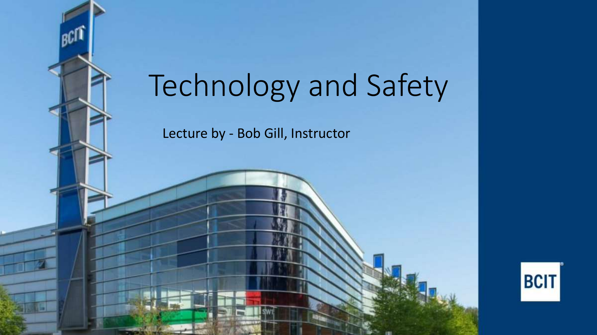
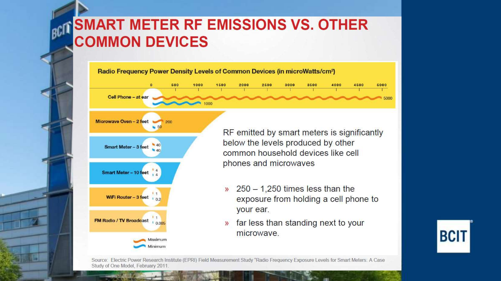
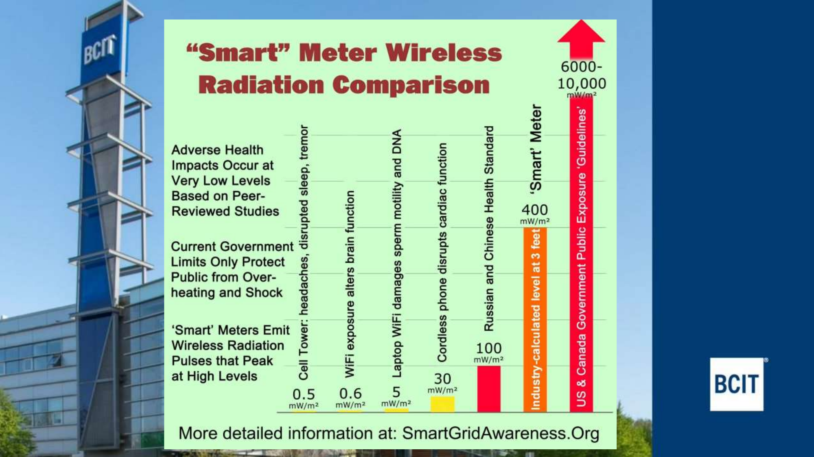
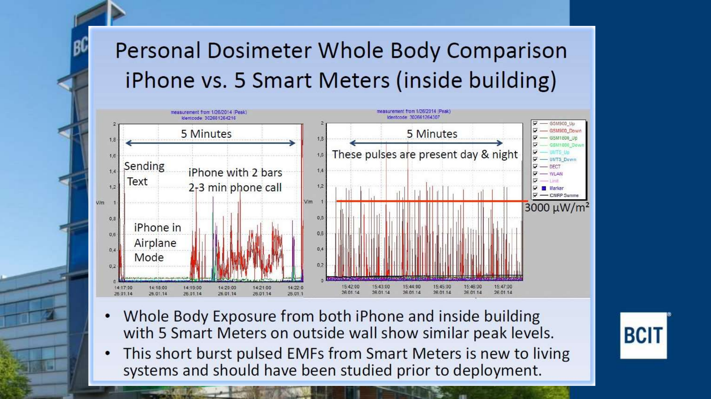
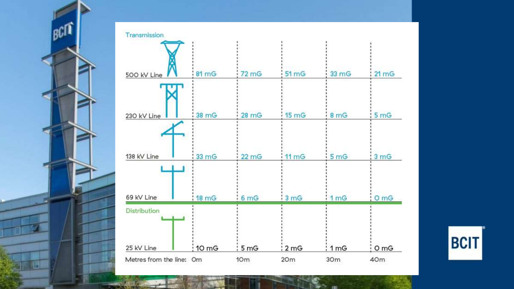
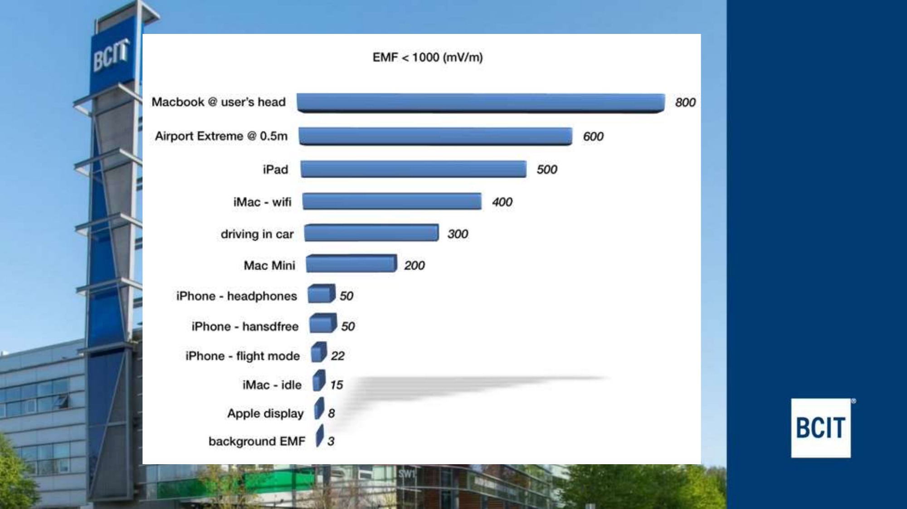
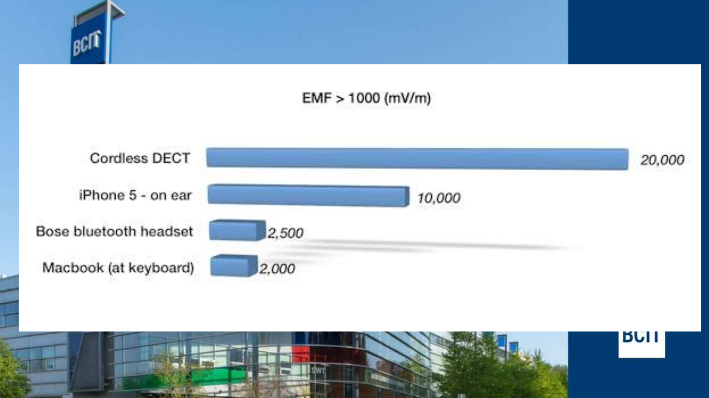
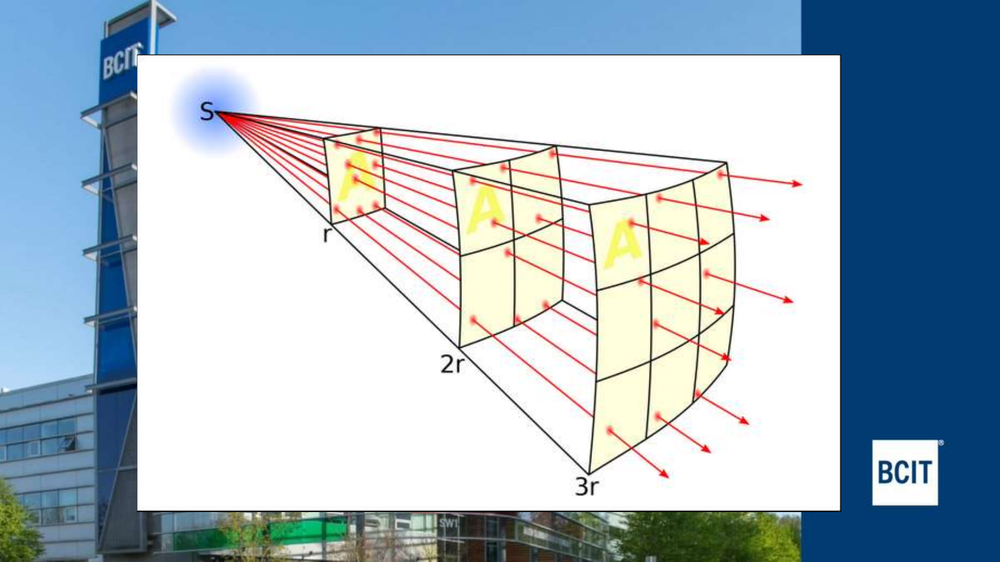
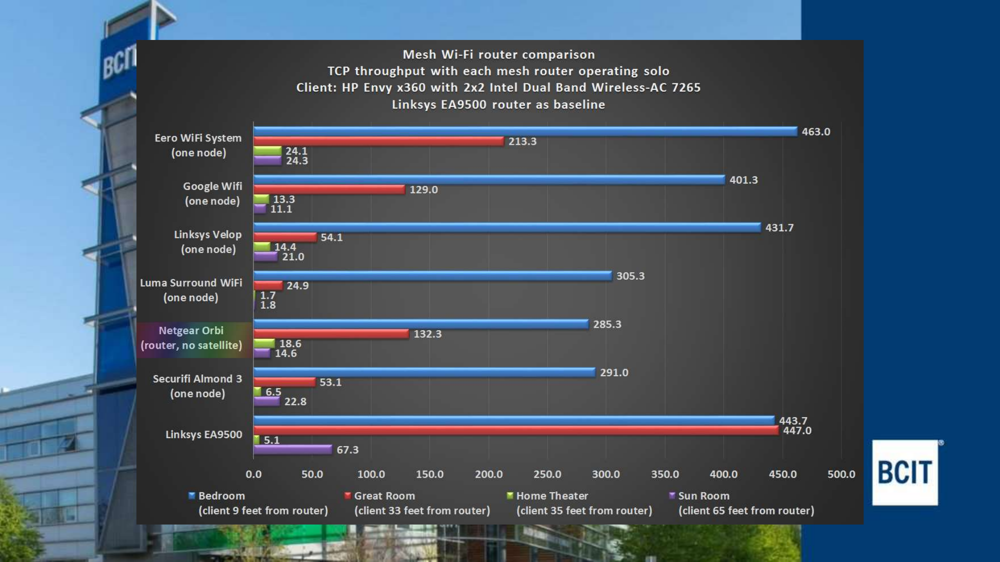
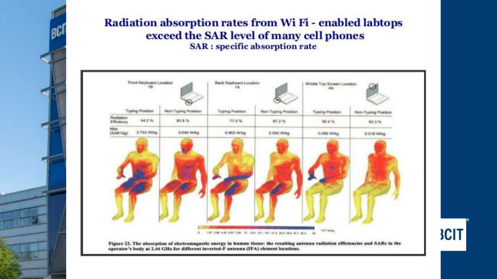
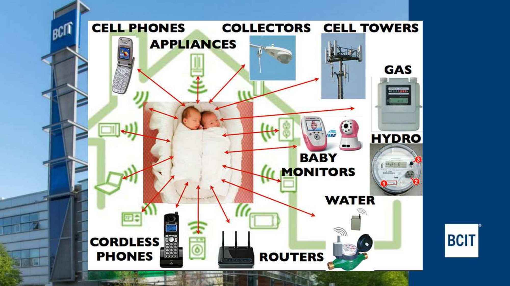
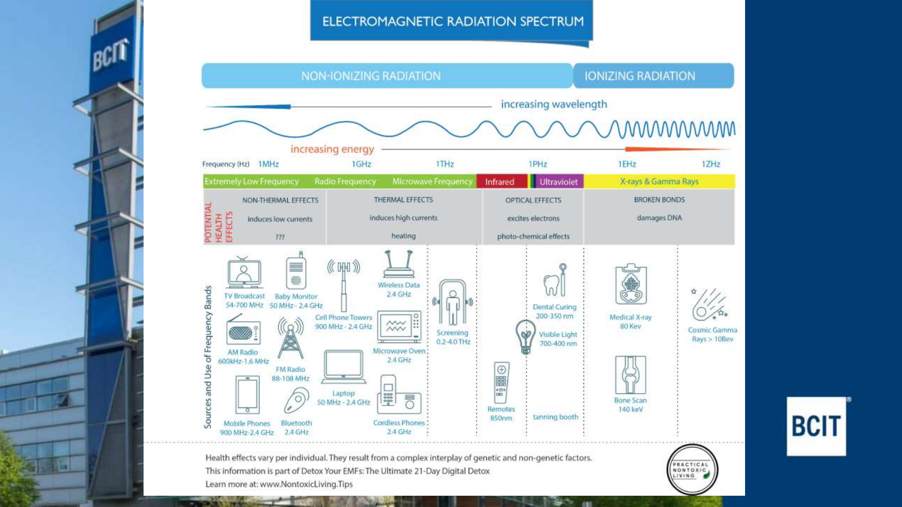
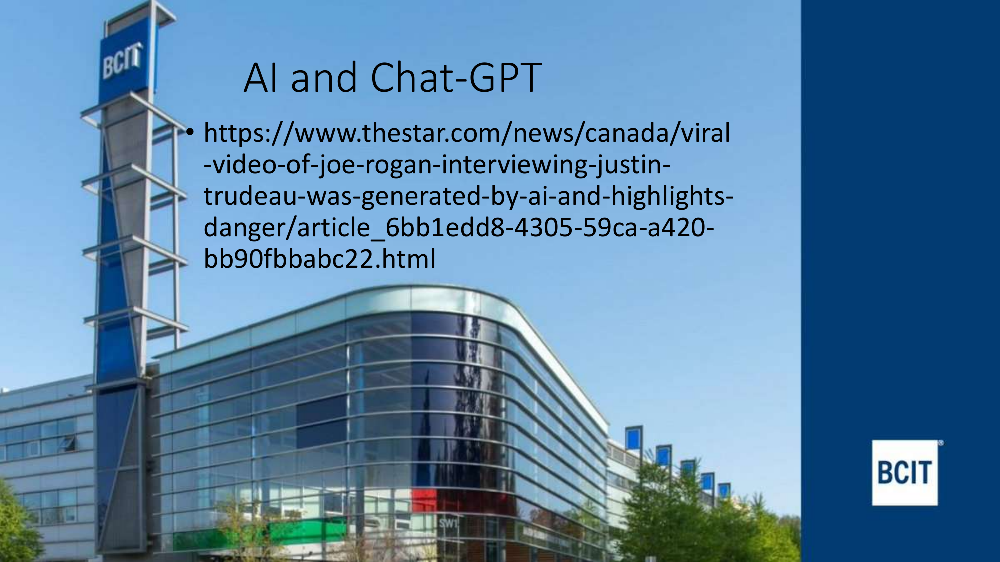

---

## Last Slide (13)

See the article: Al and Chat-GPT
https://www.thestar.com/news/canada/viral-video-of-joe-rogan-interviewing-justin-trudeau-was-generated-by-ai-and-highlights-danger/article_6bb1edd8-4305-59ca-a420-bb90fbbabc22.html

---

# 7_1 L7_1 EIT_P.Eng Path March 2026

This file will be used to collect summaries, notes, Q&A, and answers as you progress through the Copilot exam workflow.

---
## Pages 1–10 Summary
    • Overview of the professional registration path for engineers and geoscientists in BC.
    • Academic requirements: 4-year Bachelor’s degree in Engineering, Geoscience, Science, or Technology; transcripts must be sent directly from institutions.
    • Student program: access to networking, scholarships, and resources.
    • Trainee (EIT/GIT): requires supervision, demonstrates academic qualification and intent, easier transfer between provinces.
    • Engineering specifics: non-accredited degrees require confirmatory exams; Washington Accord degrees are recognized; NCEES FE option; experienced applicants may be exempted.
    • Geoscience specifics: must meet geoscience academic requirements for GIT/P.Geo.
    • Work experience: required for registration.
    • Professional responsibilities: abide by Code of Ethics, take responsibility, use professional titles.

## Pages 1–10 Q&A

1. What is the minimum academic requirement for applicants seeking professional registration in BC?
   - Answer: A 4-year Bachelor’s Degree in Engineering, Geoscience, Science, or Technology. (Reference: Academic Requirements section)

2. What benefit do students receive from the student program besides scholarships?
   - Answer: Access to networking events and the same resources as professional registrants. (Reference: Student Program section)

3. What must an EIT or GIT have in order to practice?
   - Answer: Supervision by a professional engineer or professional geoscientist. (Reference: Trainee section)

4. How are degrees from non-accredited institutions handled in the registration process?
   - Answer: Applicants are assigned three discipline-specific confirmatory examinations. (Reference: Engineering section)

5. What is one responsibility of a professional engineer or geoscientist after registration?
   - Answer: Abide by the Code of Ethics and take full responsibility for their work. (Reference: Professional Engineer/Geoscientist section)

---
## Pages 11–20 Summary

- Minimum of four years of satisfactory engineering or geoscience experience required; at least one year must be in a Canadian environment or equivalent.
- Credit for co-op, thesis-based M.A.Sc., and Ph.D. experience (up to 24 months cumulative).
- Competency-based framework for evaluating engineering and geoscience experience; online Competency Experience Reporting System used.
- Seven engineering competency categories: Technical Competence, Communication, Project/Financial Management, Team Effectiveness, Professional Accountability, Social/Economic/Environmental/Sustainability, Personal Continuing Professional Development.
- Geoscience applicants report experience using 29 competencies, grouped into Professionalism, Scientific Method, Area of Geoscience Practice, Complementary.
- Reporting system: employment history (no character limit), competencies (character limit, concise and detailed).
- Advice: use specific examples, demonstrate responsibility, show progression, avoid vague statements, review for clarity.
- Example format: describe situation, actions, and resolution; strong examples are specific and show leadership.

---
## Pages 11–20 Q&A

1. How many years of experience are required for professional registration, and what is the Canadian requirement?
   - Answer: Four years total, with at least one year in a Canadian environment or equivalent. (Reference: General Experience Requirements)

2. What is the maximum credit for post-graduate work experience?
   - Answer: Up to 24 months cumulative for co-op, thesis-based M.A.Sc., and Ph.D. experience. (Reference: Experience Gained in School)

3. What are the seven engineering competency categories?
   - Answer: Technical Competence, Communication, Project/Financial Management, Team Effectiveness, Professional Accountability, Social/Economic/Environmental/Sustainability, Personal Continuing Professional Development. (Reference: Competency Categories)

4. What is the purpose of the Competency Experience Reporting System?
   - Answer: To identify and validate how applicants meet competency categories for professional registration. (Reference: The Reporting System)

5. What advice is given for writing competency examples?
   - Answer: Use specific examples, demonstrate responsibility, show progression, avoid vague statements, review for clarity. (Reference: Advice)

---
## Pages 21–30 Summary

- Competency example format: Action and Outcome should be specific, fact-based, and demonstrate leadership and problem-solving.
- Validation of experience: Minimum of four validators required, ideally P.Eng. or P.Geo.; at least two must be supervisors; validators must have first-hand knowledge of your work.
- Selecting validators: Involve them in your application, get their input on competency examples, and ensure they agree you are ready for licensing.
- Law & Ethics requirements: Must complete the Professional Engineering & Geoscience Practice in BC Online Seminar (formerly Law & Ethics Seminar), covering law, risk management, and ethics.
- Professional Practice Exam (PPE): Law and Ethics-based exam with 110 multiple-choice questions (2.5 hours) and an essay (1 hour); computer-based, offered five times a year, currently only via virtual proctoring.
- Registration support contact provided.

---
## Pages 21–30 Q&A

1. What are the key elements of a strong competency example format?
   - Answer: Specific, fact-based actions and outcomes that demonstrate leadership and problem-solving. (Reference: Competency Example Format)

2. How many validators are required for experience validation, and what are their qualifications?
   - Answer: Minimum of four validators, ideally P.Eng. or P.Geo.; at least two must be supervisors with first-hand knowledge of your work. (Reference: Validators)

3. What is the recommended approach for selecting and involving validators?
   - Answer: Involve validators in your application, get their input on competency examples, and ensure they agree you are ready for licensing. (Reference: Selecting Your Validator)

4. What are the requirements for law and ethics training?
   - Answer: Completion of the Professional Engineering & Geoscience Practice in BC Online Seminar, covering law, risk management, and ethics. (Reference: Law & Ethics Requirements)

5. What are the main features of the Professional Practice Exam (PPE)?
   - Answer: 110 multiple-choice questions (2.5 hours), an essay (1 hour), computer-based, offered five times a year, currently only via virtual proctoring. (Reference: Professional Practice Exam)

---

# 7.1 L7.1 Keystone XL Bagiotti

This file will be used to collect summaries, notes, Q&A, and answers as you progress through the workflow.

## Pages 1–10 Summary

- Project Overview: The Keystone XL Pipeline is a proposal by TransCanada to transport crude oil from Alberta’s tar sands to Texas’s Gulf Coast via a 1,700-mile underground pipeline, moving 900,000 barrels of oil daily.
- Debate: The main controversy is between economic benefits (foreign oil supply) and environmental concerns (negative impacts).
- Environmental Impact: The pipeline is expected to have significant negative effects, especially due to tar sands extraction.
- Science & Technology:
  - Technology is defined as the interaction between humans and nature (Marx, Wendling).
  - Science is a process to improve understanding, but using tar sands contradicts this if negative impacts are ignored (Lee).
- Tar Sands:
  - Composition: clay, sand, water, bitumen (a viscous black oil).
  - Extraction emits more greenhouse gases (GHG) than any other energy extraction process.
- Extraction Technology:
  - Data and statistics show negative environmental effects.
  - Open pit mining: large shovels and trucks move tar sands to extraction plants.

### Q&A and Answers for Pages 1–10

1. What is the main purpose of the Keystone XL Pipeline project?
	- To transport crude oil from Alberta’s tar sands to Texas’s Gulf Coast.
2. Which company is behind the Keystone XL Pipeline proposal?
	- TransCanada.
3. What is the expected daily oil capacity of the pipeline?
	- 900,000 barrels.
4. What are tar sands composed of?
	- Clay, sand, water, and bitumen (a viscous black oil).
5. Why is tar sands extraction considered environmentally harmful?
	- It emits more greenhouse gases than any other energy extraction process.
6. How does open pit mining relate to tar sands extraction?
	- Large shovels dig up tar sands and transfer them in trucks to extraction plants.
7. According to Marx (via Wendling), how is technology defined in this context?
	- As the interaction between human beings and nature.
8. What is the main argument against the pipeline from an environmental perspective?
	- The pipeline will have a negative impact on the environment.
9. What is the length of the proposed pipeline?
	- 1,700 miles.
10. What is the definition of science according to Jeffrey A. Lee?
	 - Science is a process to improve our understanding of the universe and all that is in it.

## Pages 11–13 Summary

- Future Solutions: Advocates for alternative energy sources like wind turbines, which have been used since 900 A.D. and are eco-friendly.
- Peak Oil Example: Cuba survived peak oil, showing nations can adapt and thrive.
- Activism: Calls to protest against the Keystone XL Pipeline and stop the “megaload.”
- Resources: References to websites and articles for further information.
- Works Cited: Includes sources on Alberta energy, oil futures, Canadian oil sands production, U.S. oil imports, tar sands basics, and the Keystone Pipeline Project. Also cites books by Lee and Wendling.

---

### Q&A and Answers for Pages 11–13

1. What alternative energy source is highlighted as eco-friendly and historic?
   - Wind turbines.
2. Which country is mentioned as surviving peak oil?
   - Cuba.
3. What is the call to action regarding the Keystone XL Pipeline?
   - Protest against it and stop the megaload.
4. Name one cited source about tar sands.
   - Oil Shale and Tar Sands Information Center (Tar Sands Basics, 2003).
5. Who is the author of “Karl Marx on Technology and Alienation”?
   - Amy E. Wendling.
6. What is the main message about future energy solutions?
   - Use eco-friendly alternatives like wind turbines.
7. What is the purpose of the “Works Cited” section?
   - To reference sources used in the discussion.
8. Which company’s website is cited for information on the Keystone Pipeline Project?
   - TransCanada Corporation.
9. What is the significance of Cuba’s experience with peak oil?
   - It shows adaptation and resilience are possible.
10. What online resource is mentioned for activism?
    - http://www.wearepowershift.org/

# 7.2 L7.2 Northern Gateway

---

## Pages 1-10 Summary

- The Enbridge Northern Gateway Pipeline Project is a major Canadian infrastructure project.
- 1170 km twin pipeline from Alberta to Kitimat, BC.
- Oil pipeline (36”) carries 525,000 barrels/day west; condensate pipeline (20”) carries 193,000 barrels/day east.
- Features: pump stations, power lines, access roads, two large tunnels (14 km), 19-tank terminal, marine berth for large tankers.
- Specialized aspects: routing through difficult terrain, thick-walled pipe, shut-off valves at watercourse crossings, variable burial depth, containment structures, regular smart pig inspection.
- Terminal in Kitimat; marine routes to Asia and western USA.

---

## Pages 1-10 Q&A

1. What is the total length of the Northern Gateway twin pipeline?
   - 1170 km
2. What are the diameters and flow rates of the oil and condensate pipelines?
   - Oil: 36” diameter, 525,000 barrels/day west; Condensate: 20” diameter, 193,000 barrels/day east
3. Name two specialized engineering aspects used in the project.
   - Thick-walled pipe; shut-off valves at major watercourse crossings
4. Where does the pipeline terminate, and what is the purpose of the marine berth?
   - Terminates at a 19-tank land terminal in Kitimat; marine berth handles large tankers for export
5. What are the primary markets for the oil transported by the pipeline?
   - Asia and western USA

---

## Pages 11-20 Summary

- Regulatory process driven by National Energy Board (NEB) Act and Canadian Environmental Assessment Act.
- Project referred to a Joint Review Panel (JRP) with NEB and Canadian Environmental Assessment Agency members.
- JRP decision report (Dec 2013): recommended approval with 209 conditions; project deemed in public interest.
- Next steps: Federal government has 180 days to accept; First Nations consultations; Governor in Council can request reconsideration; NEB may issue Certificate of Public Convenience and Necessity (CPCN).
- After CPCN: many permits needed for land tenure, construction, environmental protection, stakeholder consultation.
- TERMPOL: Transport Canada process for marine terminals.

---

## Pages 11-20 Q&A

1. Which two acts drive the regulatory process for the Northern Gateway project?
   - National Energy Board (NEB) Act and Canadian Environmental Assessment Act
2. What is the role of the Joint Review Panel (JRP)?
   - To review the project and make recommendations, including conditions for approval
3. How many conditions did the JRP recommend for approval?
   - 209 conditions
4. What happens after the NEB issues the Certificate of Public Convenience and Necessity (CPCN)?
   - The project must seek approval for many permits related to land tenure, construction, environmental protection, and stakeholder consultation
5. What is TERMPOL?
   - A Transport Canada process for marine terminals

---

## Pages 21-30 Summary

- Aboriginal political landscape: 50+ communities along pipeline, coastal interests, lack of treaties, undefined rights/title.
- ENGO heavy oil campaigns: US/Canada efforts to shut down oil sands, block new shipping options, tied to stopping oil sands use in US.
- Media: large project size/profile led to substantial media attention, sometimes sensationalist, making balanced reporting difficult.
- Accidents and malfunctions: historical spills (Exxon Valdez, BC ferry, BP Macondo, Enbridge Kalamazoo, Fort McMurray, NWT) intensified debate about risks.
- Environmental effects and mitigation: key concerns include fish habitat, rare plants, wetlands, caribou and grizzly bear habitats, SARA species, traditional land use, and oil spills.

---

## Pages 21-30 Q&A

1. How many Aboriginal communities are along the pipeline route?
   - Over 50
2. What are some key environmental concerns related to the pipeline?
   - Fish habitat, rare plants, wetlands, caribou and grizzly bear habitats, SARA species, traditional land use, oil spills
3. Name two major historical spills that intensified debate about pipeline risks.
   - Exxon Valdez (1989), BP Macondo blowout
4. What is the focus of ENGO campaigns regarding the oil sands?
   - Shutting down oil sands and stopping new shipping options
5. Why is media coverage of the project sometimes problematic?
   - Sensationalist reporting makes it difficult to get balanced and impartial views on real science

## Pages 31-32 Summary

- Managers must navigate a complex and lengthy regulatory review process.
- Public understanding of operations, issues, and solutions is crucial.
- Media has significant power in shaping perceptions.
- Social license is important for project acceptance.
- Unprecedented scope of mitigation and compensation required.
- Spill response and risk communication are key considerations.

---

## Pages 31-32 Q&A

1. What is a major challenge for managers regarding the regulatory process?
   - Navigating a complex and lengthy review process
2. Why is public understanding important for the project?
   - It helps address operations, issues, and solutions, and supports project acceptance
3. What role does the media play in the Northern Gateway project?
   - Media shapes public perception and can influence support or opposition
4. What is meant by "social license" in the context of the project?
   - Public and stakeholder acceptance of the project
5. Why are spill response and risk communication important?
   - They are essential for managing incidents and maintaining trust

---

# Quick Tips for Today's Exam

1. **Contract essentials — know the 5 elements:** Offer, Acceptance, Consideration, Legal Capacity, Intention to Create Legal Relations. If a question asks what's missing from a scenario, check these first.
2. **Delivery models matter:** Be able to distinguish Design-Select-Build, Design-Build, Construction Management, and P3 — especially who contracts with whom.
3. **Tort vs. Crime:** A tort is a civil wrong (monetary compensation); a crime is against society (prosecution). The same act can be both.
4. **Negligence framework:** Duty of Care → Standard of Care (reasonable person test) → Causation → Remoteness → Damages. Walk through this chain for any negligence question.
5. **Donoghue v Stevenson** is the landmark case — duty of care, product liability, privity doesn't block negligence claims.
6. **Defamation defenses:** Truth (absolute), opinion, privilege, fair comment, retraction.
7. **Limitation periods:** 2 years for personal injury / property damage, 6 years for other losses, 30-year ultimate limit.
8. **Dispute resolution order (least → most formal):** Consultant → Negotiation → Non-binding 3rd party → Mediation → Arbitration → Litigation.
9. **Pipeline projects — key differences:** Keystone XL = 1,700 mi, Alberta → Texas, 900k bbl/day. Northern Gateway = 1,170 km twin pipeline, Alberta → Kitimat, 525k bbl/day oil + 193k condensate.
10. **EIT/P.Eng path:** 4-year degree + 4 years experience (1 yr Canadian) + 4 validators + Law & Ethics seminar + PPE (110 MC + essay).
11. **Read every question twice.** Flag anything you're unsure about and come back — don't burn time on one question.
12. **For essay / short-answer:** Structure matters. State the rule, apply it to the facts, then conclude. Keep it concise.

Good luck! 
